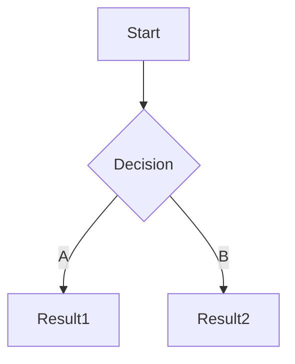

## 1. Target

某些网站会收集在 [站点导航](https://www.10086.cn/web_notice/navigation/) 中, 直接访问即可

### 1.1. Notice

在公告中查看目标的收录范围, 和测试限制

```
中国移动所有产品和服务
```

### 1.2. ICP

通过主办单位名称, 备案号, 域名交叉查询

```
中国移动通信有限公司
京ICP备05002571号

10086.cn
cmccb2b.com
monternet.com
chinamobile.com
warmchina121.com
```

> 即使主域名无法访问, 也需要保存, 后期可用于收集子域名

## 2. Recon

### 2.1. Subdomain

> 导出 IP, URL 和 Port

HUNTER

```
domain.suffix="10086.cn"&&header.status_code="200"&&ip.country="CN"
```

FOFA

```
domain="10086.cn" && status_code="200" && country="CN"
```

QUAKE

```
domain:"10086.cn" AND status_code:200 AND country:"CN"
```

ZoomEye

```
domain="10086.cn" && http.header.status_code="200" && country="CN"
```

API

```
fofa查询 domain="10086.cn" && status_code="200" && country="CN" && size=10000
```

### 2.2. Port

使用 masscan 进行全端口扫描

```
┌──(nemo@debian)-[~]
└─$ sudo masscan -p- <ip>
```

使用 nmap 扫描指定端口

```
┌──(nemo@debian)-[~]
└─$ sudo nmap -p <prot1,port2...> -Pn <ip>
```

## 3. PoC

使用 nmap 获取服务类型和版本

```
┌──(nemo@debian)-[~]
└─$ sudo nmap -p <port> -sV <ip>
```

查看相关脚本

```
┌──(nemo@debian)-[~]
└─$ ls /usr/share/nmap/scripts/
```

漏洞扫描

```
┌──(nemo@debian)-[~]
└─$ sudo nmap -p <port> --script "<vuln>*" -d <ip> --host-timeout 10m
```

## 4. Information Disclosure

### 4.1. Access Control

Google

```
site:"10086.cn" ("AccessKeyID" OR "AccessKeySecret")
```

Search Public Code

```
"10086.cn" AND ("AccessKeyID" OR "AccessKeySecret")
```

HUNTER

```
domain.suffix="10086.cn"&&(web.body="AccessKeyID"||web.body="AccessKeySecret")
```

FOFA

```
domain="10086.cn" && (body="AccessKeyID" || body="AccessKeySecret")
```

QUAKE

```
domain:"10086.cn" AND (body="AccessKeyID" OR body:"AccessKeySecret")
```

ZoomEye

```
domain="10086.cn" && (http.body="AccessKeyID" || http.body="AccessKeySecret")
```

得到 AccessKey 后可使用 [OSSBrowser](https://help.aliyun.com/zh/oss/developer-reference/ossbrowser-2-0-overview?spm=a2c4g.11186623.help-menu-31815.d_3_4_3_0.29b73cca99hU99) 登录

### 3.2. Source Code Disclosure

Search Public Code

```
"10086.cn"
```

## 5. Automated Testing

BurpSuite > Target > Scope > Crawl > Discover content > Passively scan

## 6. Manual Testing

访问 `subdomain.txt` 中的每个站点;

使用 BurpSuite 手工测试业务板块, 并结合 View page source 以及 FindSomething 查找隐藏信息;

记录已经测试的业务并使用 Mermaid 绘制流程图.


