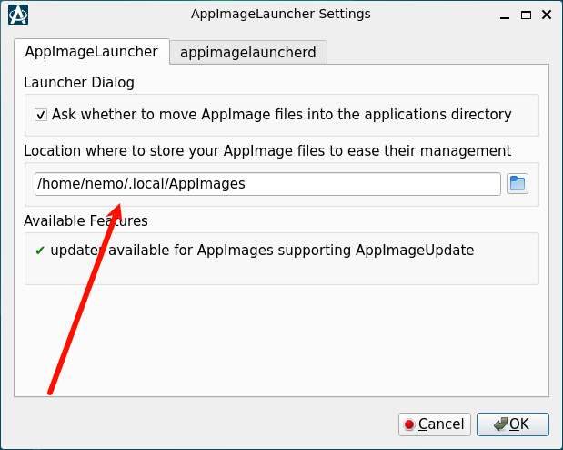

Helper application for Linux distributions serving as a kind of "entry point" for running and integrating AppImages
 
## 1. Install

安装

```
┌──(nemo@debian)-[~]
└─$ cd /tmp \
&& curl -LO https://github.com/TheAssassin/AppImageLauncher/releases/download/v2.2.0/appimagelauncher_2.2.0-travis995.0f91801.bionic_amd64.deb \
&& sudo apt install -y ./appimagelauncher*.deb
```

##  2. Init

创建目录文件

```
┌──(nemo@debian)-[~]
└─$ mkdir -p ~/.local/Applications 
```

修改默认存储位置

```
/home/nemo/.local/Applications
```




## 3. Usage

双击运行 app.AppImage 将应用集成到系统菜单中


---

References

- [AppImageLauncher](https://github.com/TheAssassin/AppImageLauncher)
