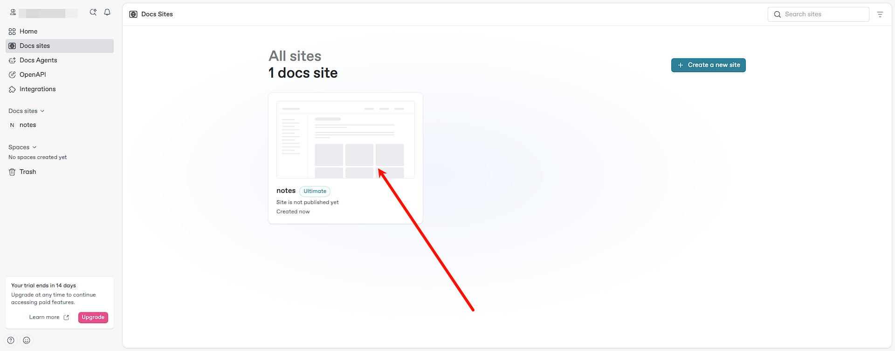

将 GitBook 关联到 GitHub，自动同步 GitHub 中的文档。

## 1.Init

Create a new site

Site name

Click

Sync with Git

Select GitHub Sync

Connect with GitHub

Authorize

Install the GitHub app

Select repositories

Reconnect

Re-authorize

Account Settings

Initial sync

---

Refrences

- [GitBook](https://www.gitbook.com/)
- [GitBook Documentation](https://docs.gitbook.com/)

