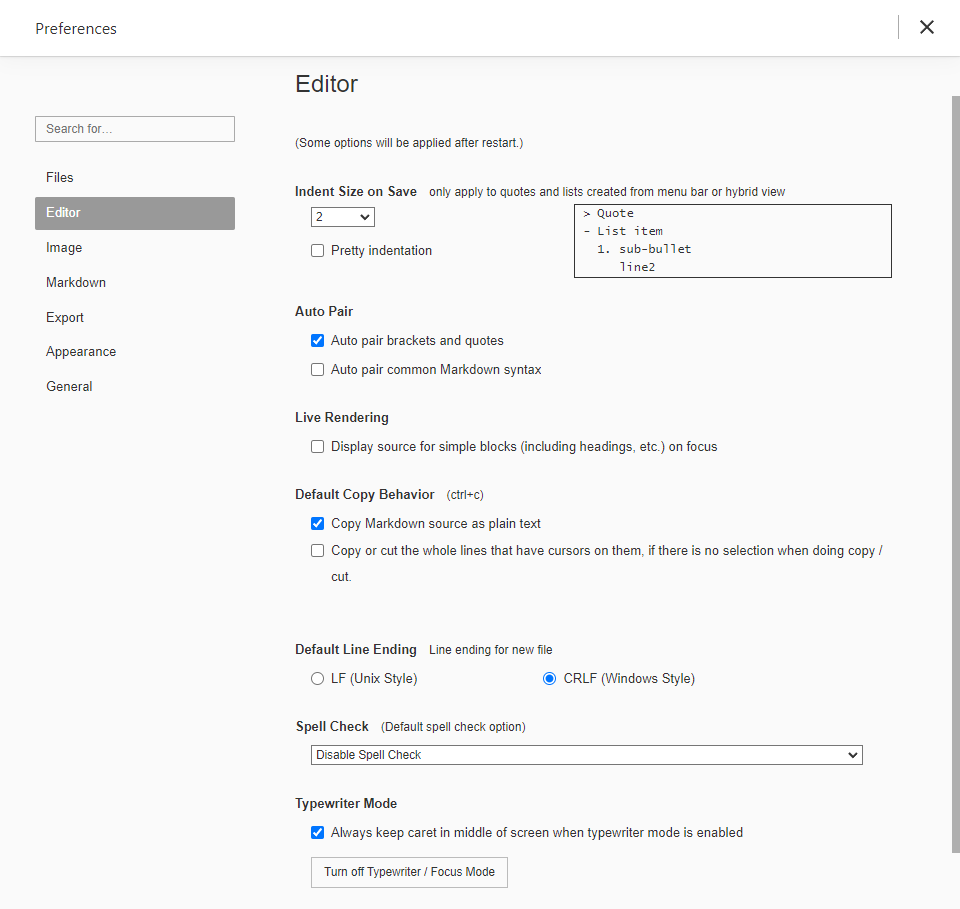
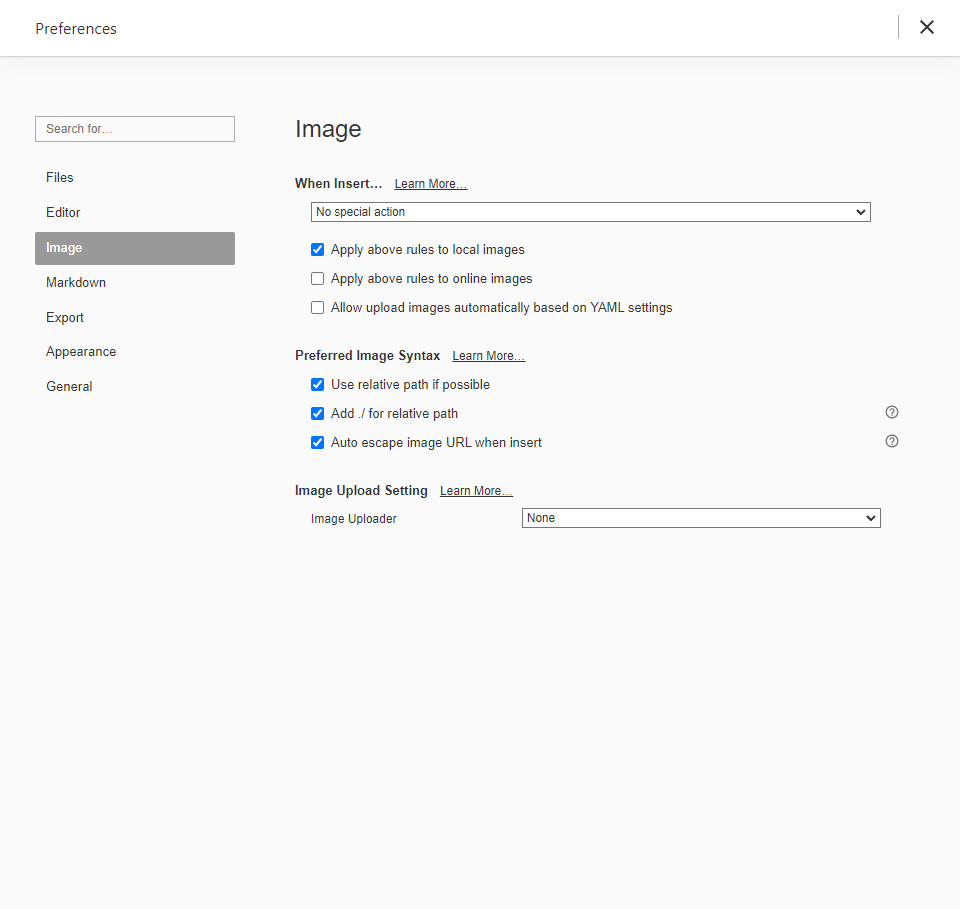
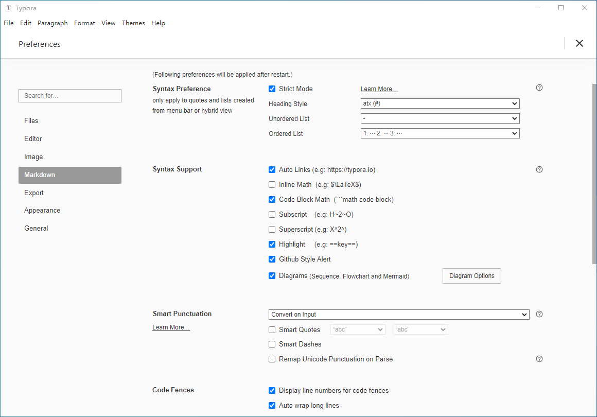
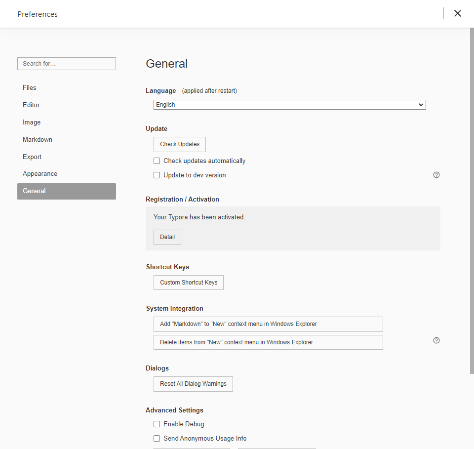

A minimal Markdown editor and reader.

## 1. Init

Files

Editor

Image

Markdown

Appearance

General

---

Refrences

- [Typora](https://typora.io/)
- [Typora Support](https://support.typora.io/)

