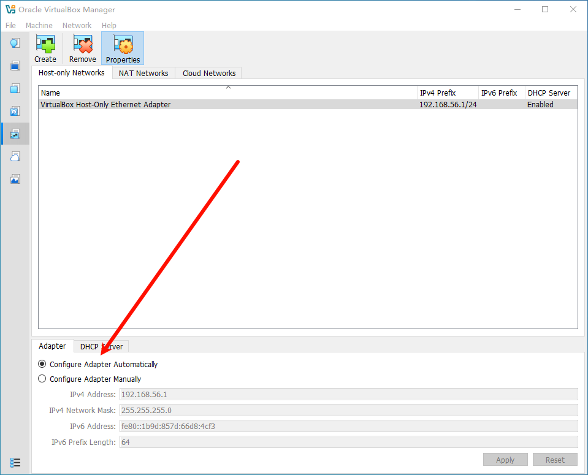

VirtualBox is a general-purpose full virtualization software for x86_64 hardware (with version 7.1 additionally for macOS/Arm), targeted at laptop, desktop, server and embedded use.

## 1. Install

禁用 VirtualBox Python Support


不在桌面创建快捷方式


## 2. Init

创建目录文件

```
C:\Users\nemo\VirtualBox VMs\iso
```

Manual Proxy Configuration


### 2.1. 配置 Host-only Networks

> Host-only 用于虚拟机之间互相访问

打开 File - Tools - Network


创建一个 Host-only Networks


Adapter



DHCP Server


## 3. Usage

Port Forwarding

> 推荐设定范围为: 49152-65535


Insert Guest Additions CD images


Network 配置为 Host-only 可被其它虚拟机访问


---

- [Oracle VirtualBox](https://www.virtualbox.org/)

