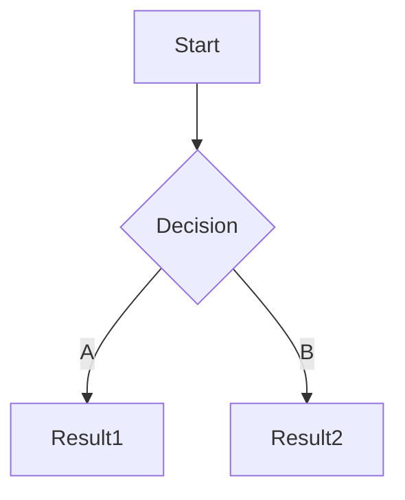

## 1. Target

某些网站会收集在 [站点导航](https://www.10086.cn/web_notice/navigation/) 中, 直接访问即可

### 1.1. Notice

在公告中查看目标的收录范围和测试限制

```
中国移动所有产品和服务
```

### 1.2. ICP

通过主办单位名称, 备案号, 域名交叉查询

```
中国移动通信有限公司
京ICP备05002571号

10086.cn
cmccb2b.com
monternet.com
chinamobile.com
warmchina121.com
```

> 即使主域名无法访问, 也需要保存, 后期可用于收集子域名

### 1.3. WHOIS

查询 Registrant Organization

```
┌──(nemo@debian)-[~]
└─$ whois 10086.cn | grep "Registrant Organization"
```

## 2. Recon

### 2.1. Subdomain

subfinder

```
┌──(nemo@debian)-[~]
└─$ subfinder -d 10086.cn -nW -o subfinder_10086.cn.txt
```

API

```
fofa查询 domain="10086.cn" && status_code="200" && size=10000
```

HUNTER

```
domain.suffix="10086.cn"&&header.status_code="200"
```

FOFA

```
domain="10086.cn" && status_code="200"
```

QUAKE

```
domain:"*.10086.cn" AND status_code:"200"
```

ZoomEye

```
domain="*.10086.cn" && http.header.status_code="200"
```

### 2.2. DNS

查询 A 记录并保存 DNS 响应

```
┌──(nemo@debian)-[~]
└─$ echo test.10086.cn | dnsx -a -ro -o ./dnsx_test.10086.cn.txt
```

### 2.3. CDN

保存列表中使用了 CDN 的 IP

```
┌──(nemo@debian)-[~]
└─$ cdncheck -i ./dnsx_test.10086.cn.txt -cdn -o ./cdncheck_test.10086.cn.txt
```

> 若无法排除 CDN, 则手动排查

## 2.4. Port


masscan + nmap + naabu

httpx 找到可访问 URL


## 3. Information Disclosure

在 Search Public Code 或 GitHub 中审计相关仓库

```
"10086.cn"
```

## 4. Automated Testing

BurpSuite > Target > Scope > Crawl > Discover content > Passively scan

## 5. Manual Testing

访问 `subdomain.txt` 中的每个站点;

使用 BurpSuite 手工测试业务板块, 并结合 View page source 以及 FindSomething 查找隐藏信息;

记录已经测试的业务并使用 Mermaid 绘制流程图.


