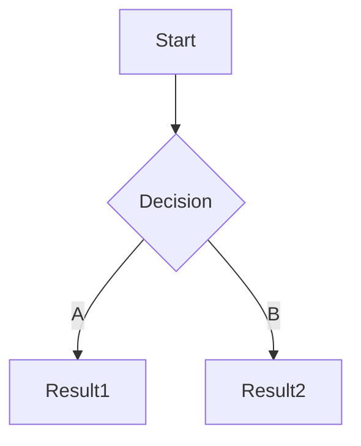

## 1. Target

### 1.1. Notice

在公告中查看目标的收录范围, 和测试限制

```
中国移动所有产品和服务
```

### 1.2. Whois

查询域名, 获取注册信息

```
┌──(sec@debian)-[~]
└─$ whois 10086.cn | tee -a whois.txt
```

```
中国移动通信有限公司
```

### 1.3. ICP

[ICP/IP地址/域名信息备案管理系统](https://beian.miit.gov.cn/)

通过主办单位名称, 备案号, 域名交叉查询

```
中国移动通信有限公司
京ICP备05002571号

10086.cn
cmccb2b.com
monternet.com
chinamobile.com
warmchina121.com
```

> 即使主域名无法访问, 也需要保存, 后期可用于收集子域名

## 2. Recon

某些网站会收集在 [站点导航](https://www.10086.cn/web_notice/navigation/) 中, 直接访问即可

### 2.1. Subdomain

FOFA

```
fofa查询 domain="10086.cn" && status_code="200" && country="CN" && cert.is_valid=true size=10000
```

subfinder

```
┌──(sec@debian)-[~]
└─$ subfinder -d 10086.cn -o subfinder_10086.cn.txt
```

> 将收集到的子域名整合到 `subdomain.txt` 

## 3. 信息泄露

### 3.1. AccessKey 泄露

### 3.1.1. Web

Google

```
site:"10086.cn" ("AccessKeyID" OR "AccessKeySecret")
```

HUNTER

```
domain.suffix="10086.cn"&&(web.body="AccessKeyID"||web.body="AccessKeySecret")
```

FOFA

```
domain="10086.cn" && (body="AccessKeyID" || body="AccessKeySecret")
```

QUAKE

```
domain:"10086.cn" AND (body="AccessKeyID" OR body:"AccessKeySecret")
```

ZoomEye

```
domain="10086.cn" && (http.body="AccessKeyID" || http.body="AccessKeySecret")
```

### 3.1.2. Repo

Search Public Code

```
"10086.cn" AND ("AccessKeyID" OR "AccessKeySecret")
```

Scan a repo for only verified secrets

```
trufflehog git https://github.com/10086.cn/test_keys --results=verified,unknown
```

得到 AccessKey 后可使用 [OSSBrowser](https://help.aliyun.com/zh/oss/developer-reference/ossbrowser-2-0-overview?spm=a2c4g.11186623.help-menu-31815.d_3_4_3_0.29b73cca99hU99) 登录

## 4. 手工测试

访问 `subdomain.txt` 中的每个站点;

使用 BurpSuite 手工测试业务板块, 并结合 FindSomething 查找隐藏信息;

记录已经测试的业务并使用 Mermaid 绘制流程图.



