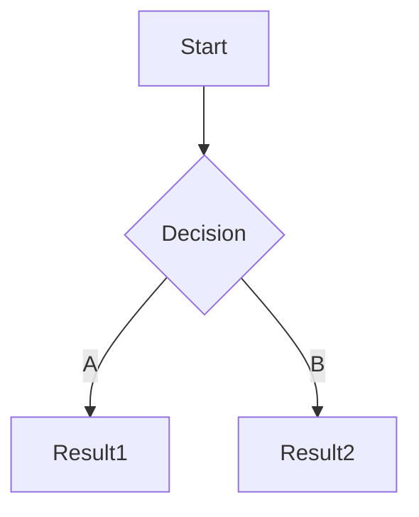

## 1. Target

某些网站会收集在站点导航中, 直接访问即可

### 1.1. Notice

在公告中查看目标的收录范围和测试限制

```
HackerOne 所有产品和服务
```

### 1.2. ICP

通过主办单位名称, 备案号, 域名交叉查询

```
HackerOne 公司
美ICP备00000000号

hackerone.com
hacker101.com
```

> 即使主域名无法访问, 也需要保存, 后期可用于收集子域名

### 1.3. WHOIS

查询 Registrant Organization

```
┌──(nemo@debian)-[~]
└─$ whois hackerone.com | grep "Registrant Organization"
```

## 2. Recon

### 2.1. Subdomain

subfinder

```
┌──(nemo@debian)-[~]
└─$ subfinder -d hackerone.com -nW -o subfinder_hackerone.com.txt
```

API

```
fofa查询 domain="hackerone.com" && status_code="200" && size=10000
```

HUNTER

```
domain.suffix="hackerone.com"&&header.status_code="200"
```

FOFA

```
domain="hackerone.com" && status_code="200"
```

QUAKE

```
domain:"*.hackerone.com" AND status_code:"200"
```

ZoomEye

```
domain="*.hackerone.com" && http.header.status_code="200"
```

### 2.2. DNS

查询 A 记录并保存 DNS 响应

```
┌──(nemo@debian)-[~]
└─$ echo docs.hackerone.com | dnsx -a -ro -o ~/dnsx_docs.hackerone.com.txt
```

### 2.3. CDN

保存列表中使用了 CDN 的 IP

```
┌──(nemo@debian)-[~]
└─$ cdncheck -i ~/dnsx_docs.hackerone.com.txt -cdn -o ~/cdncheck_docs.hackerone.com.txt
```

> 若无法排除 CDN, 则手动排查, 获取源 IP

### 2.4. Port

扫描常见端口

```
┌──(sec@debian)-[~]
└─$ sudo naabu -host docs.hackerone.com -Pn -o ~/naabu_docs.hackerone.com.txt
```

对源 IP 进行全端口扫描

```
┌──(nemo@debian)-[~]
└─$ sudo masscan -p- 172.64.151.42 -oL ~/masscan_172.64.151.42.txt
```

识别开放端口

```
┌──(nemo@debian)-[~]
└─$ sudo nmap -p 21,22,3306 -T4 -Pn -sV -O 172.64.151.42 -oN ~/nmap_172.64.151.42.txt
```

### 2.5. HTTP

探测存活的站点

```
┌──(nemo@debian)-[~]
└─$ httpx -l ~/naabu_docs.hackerone.com.txt -o ~/httpx_docs.hackerone.com.txt
```

### 2.6. Fingerprint

技术栈识别

```
┌──(nemo@debian)-[~]
└─$ whatweb -a 3 -i ~/httpx_docs.hackerone.com.txt --color=never | tee ~/whatweb_docs.hackerone.com.txt
```

WAF 识别

```
┌──(nemo@debian)-[~]
└─$ wafw00f -a -i ~/httpx_docs.hackerone.com.txt -o ~/wafw00f_docs.hackerone.com.txt
```

## 3. Info Disclosure

在 Search Public Code 或 GitHub 中审计相关仓库

```
"hackerone.com" OR "hacker101.com"
```

扫描凭证

```
┌──(nemo@debian)-[~]
└─$ trufflehog git https://github.com/trufflesecurity/test_keys
```

## 4. Automated Testing

对每个站点进行爬虫, 目录扫描和被动扫描

```
BurpSuite > Target > Scope > Crawl > Discover content > Passively scan
```

## 5. Manual Testing

使用 BurpSuite 手工测试业务板块, 并结合 DevTools 以及 FindSomething 查找隐藏信息;

记录已经测试的业务并使用 Mermaid 绘制流程图.


