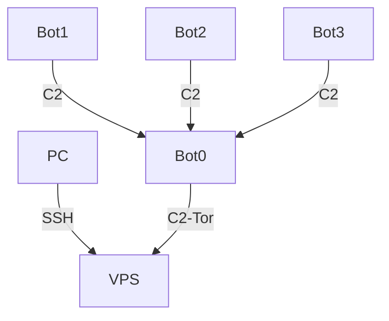

1. 在 VPS 上搭建 Onion Service, 并部署 C2 服务端;
2. 让 Bot0 的 C2 客户端通过 Tor 网络连接 VPS, 并部署 C2 服务端;
3. 其它 Bot 的 C2 客户端直接连接 Bot0.

---

References

- [TOR Fronting - Utilising Hidden Services for Privacy [Introduction]](https://www.youtube.com/watch?v=I3ovfrqcF0I)
- [TOR Fronting - Utilising Hidden Services for Privacy [Tutorial]](https://www.youtube.com/watch?v=OARw7yg0Ypc)
- [隐匿的攻击之-Tor Fronting](https://evi1cg.me/archives/Tor_Fronting.html)
- [利用Tor进行C2隐藏的一些探索](https://010.moe/docs/2021-8-23-hidden-c2-by-tor.html)