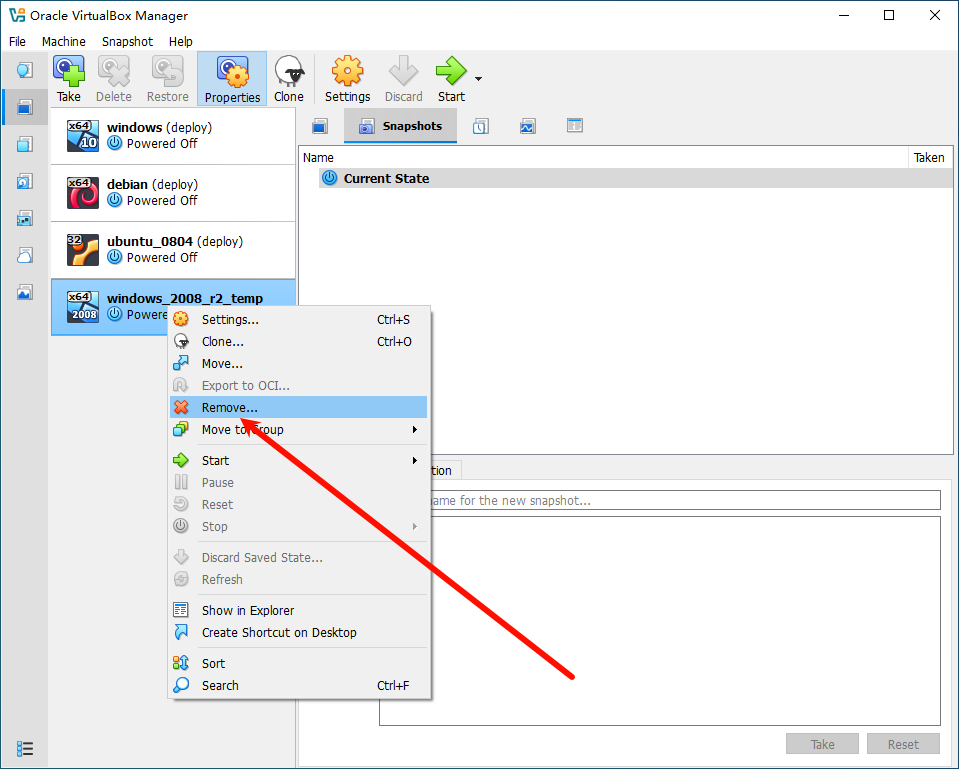

Metasploitable3 is a VM that is built from the ground up with a large amount of security vulnerabilities.

## 1. Step

- [VirtualBox](https://www.virtualbox.org/)
- [Metasploitable3-ub1404.ova](http://cs.smumn.edu/courses/ISO/Metasploitable3-ub1404.ova)
- [metasploitable3-workspace_win2k8_1708656020049_82427.ova](http://cs.smumn.edu/courses/ISO/metasploitable3-workspace_win2k8_1708656020049_82427.ova)

## 2. Init

### 2.1. ubuntu_1404

Import

```
ubuntu_1404_temp
```


Start


Change Network Settings


Attached to NAT


Login

```
vagrant:vagrant
```

Power off

```
sudo poweroff
```

Export

```
ubuntu_1404.ova
```


Remove

> Delete the virtual machine files and virtual hard disks


### 2.2. windows_2008_r2

Import


```
windows_2008_r2_temp
```

Start


Insert Ctrl-Alt-Del


Login

```
vagrant:vagrant
```

Ask me later


Restart Now


Shut down


Export

```
windows_2008_r2.ova
```


Remove

> Delete the virtual machine files and virtual hard disks



## 3. Deploy

Import, Take Snapshot: `deploy` 

```
ubuntu_1404.ova
```

```
windows_2008_r2.ova
```

## 4. Usage

Login `vagrant:vagrant` 

---

References

- [metasploitable3](https://github.com/rapid7/metasploitable3)
- [SMUMN Computer Science Department](http://cs.smumn.edu/)