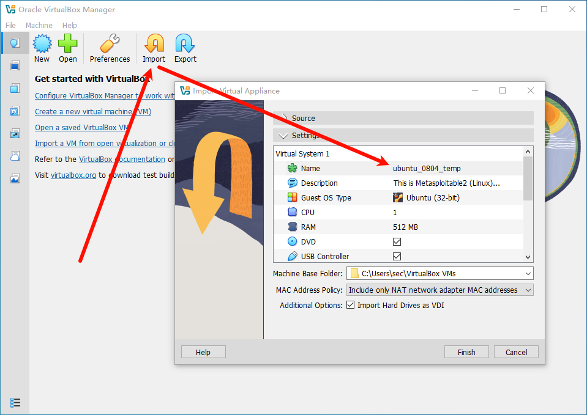
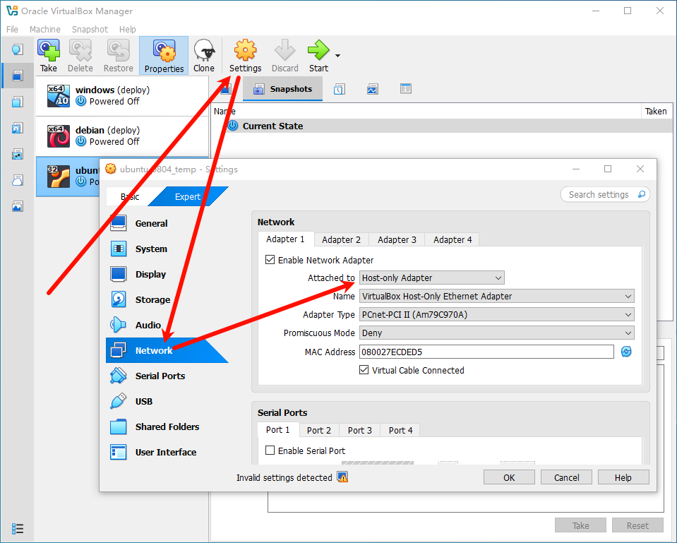
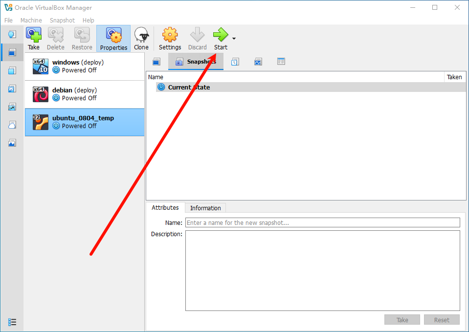
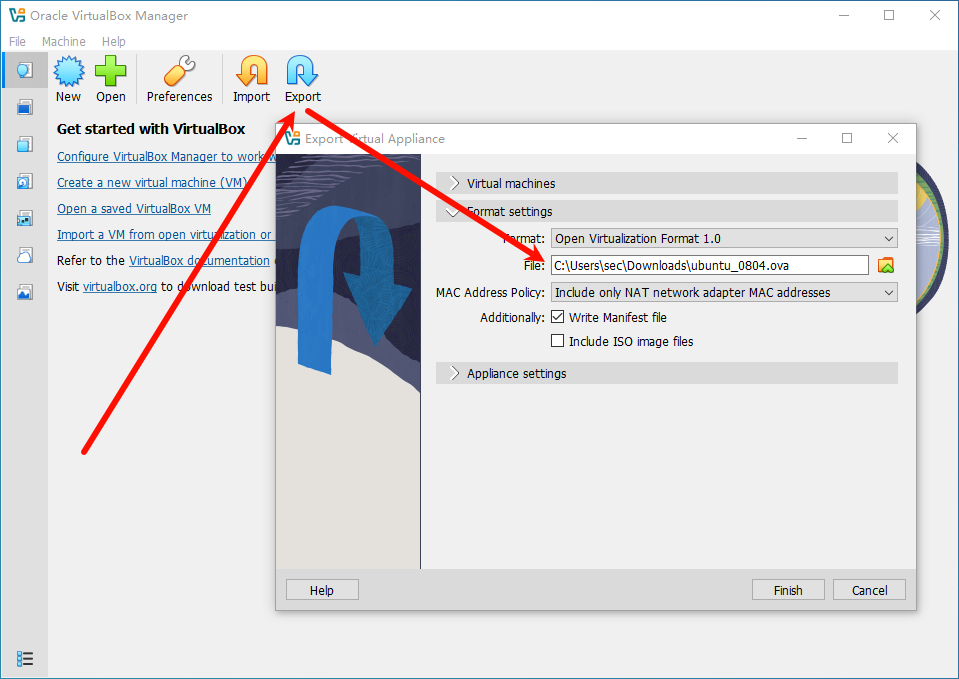
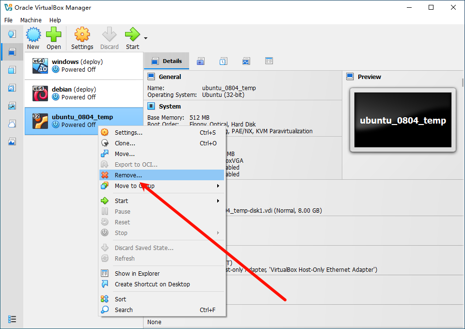

A test environment provides a secure place to perform penetration testing and security research.

## 1. Step

- [VMware Workstation Pro](https://support.broadcom.com/group/ecx/productdownloads?subfamily=VMware%20Workstation%20Pro&freeDownloads=true)
- [VirtualBox](https://www.virtualbox.org/)
- [metasploitable-linux-2.0.0.zip](https://sourceforge.net/projects/metasploitable/)

## 2. Init

使用 VMware Workstation Pro 打开虚拟机


导出为 OVA

```
ubuntu_0804_temp.ova
```


Import

```
ubuntu_0804_temp
```



Host-only



Start



Login

```
msfadmin:msfadmin
```

Power off

```
sudo poweroff
```

Export

```
ubuntu_0804.ova
```



Remove

> Delete the virtual machine files and virtual hard disks



## 3. Deploy

Import, Take Snapshot: `deploy` 

```
ubuntu_0804.ova
```

## 4. Usage

Login `msfadmin:msfadmin` 

---

References

- [metasploitable2](https://docs.rapid7.com/metasploit/metasploitable-2/)