# 部署

**Linux**

安装

```shell
root@debian:~# apt install -y git
```

**Windows**

配置默认组件

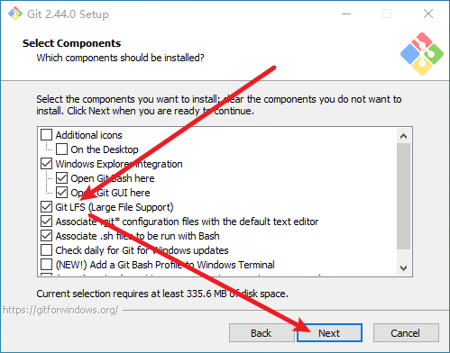

配置默认编辑器

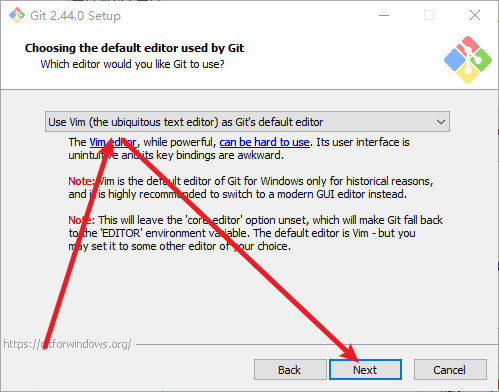

配置默认分支

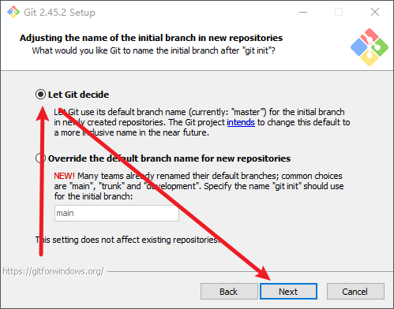

配置默认环境变量

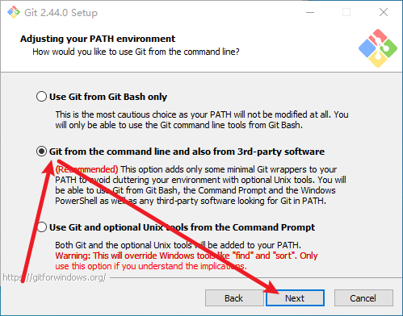

配置默认 OpenSSL

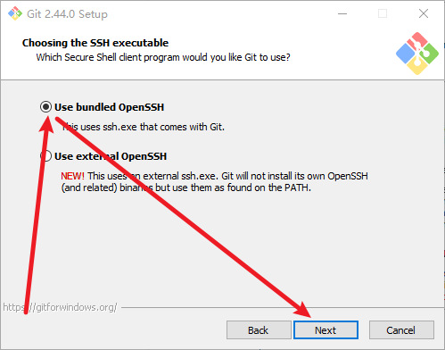

配置默认 OpenSSL 库

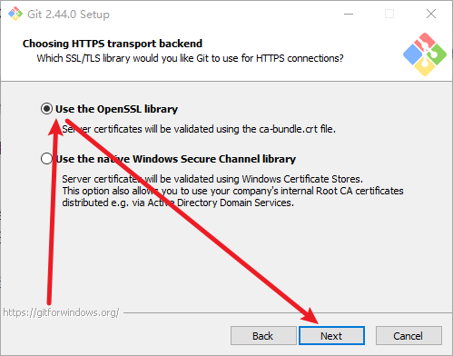

配置默认行尾符号转换

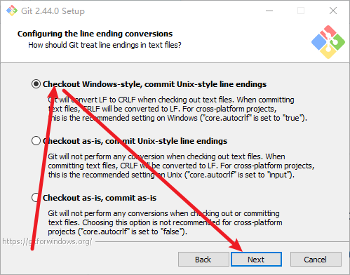

配置默认终端

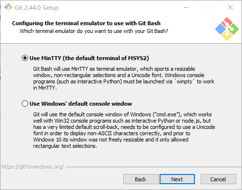

配置 git pull 默认行为

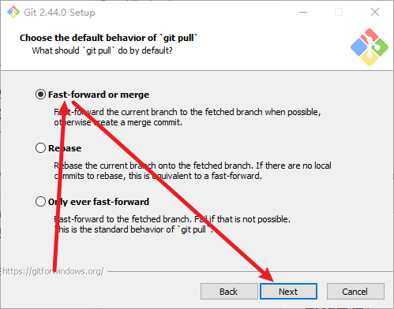

配置默认凭证管理器

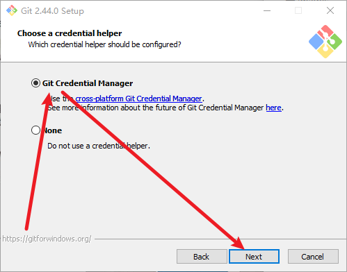

配置默认文件系统缓存

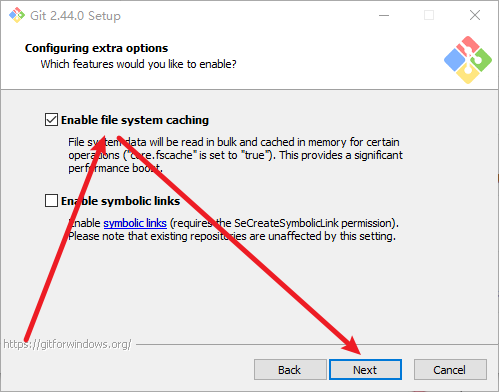

配置默认实验选项

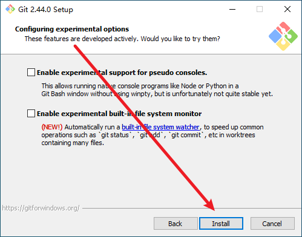

## 初始化

### Linux

配置代理

```shell
root@debian:~# git config --global http.proxy "socks://192.168.1.201:10808"
```

### Windows

配置代理

```powershell
PS C:\Users\sec> git config --global http.proxy "socks://127.0.0.1:10808"
```

配置 SSH 客户端

```powershell
PS C:\Users\sec> git config --global core.sshCommand "C:/Windows/System32/OpenSSH/ssh.exe"
```

配置用户名和邮箱

```powershell
PS C:\Users\sec> git config --global user.name "sec"
```

```powershell
PS C:\Users\sec> git config --global user.email "xxxxxxxx@users.noreply.github.com"
```

查看所有配置

```powershell
PS C:\Users\sec> git config --global --list
```

使用 OpenSSH 部署公钥到 Git 服务器


# 使用

## 配置

查看全部配置

```shell
┌──(root㉿kali-23)-[~]
└─# git config --global --list
```

查看源

```shell
┌──(root㉿kali)-[~]
└─# git config --global --get-regexp "url\..*\.insteadOf"
```

配置源

```shell
┌──(root㉿kali)-[~]
└─# git config --global url."https://ghp.ci/https://github.com/".insteadOf https://github.com/
```

移除源

```shell
┌──(root㉿kali)-[~]
└─# git config --global --unset url."https://ghp.ci/https://github.com/.insteadOf"
```

查看代理

```shell
┌──(root㉿kali)-[~]
└─# git config --global http.proxy
```

配置代理

```shell
┌──(root㉿kali)-[~]
└─# git config --global http.proxy socks5://127.0.0.1:10808
```

移除代理

```shell
┌──(root㉿kali)-[~]
└─# git config --global --unset http.proxy
```

## 发布

在 Github 开启私人电子邮件

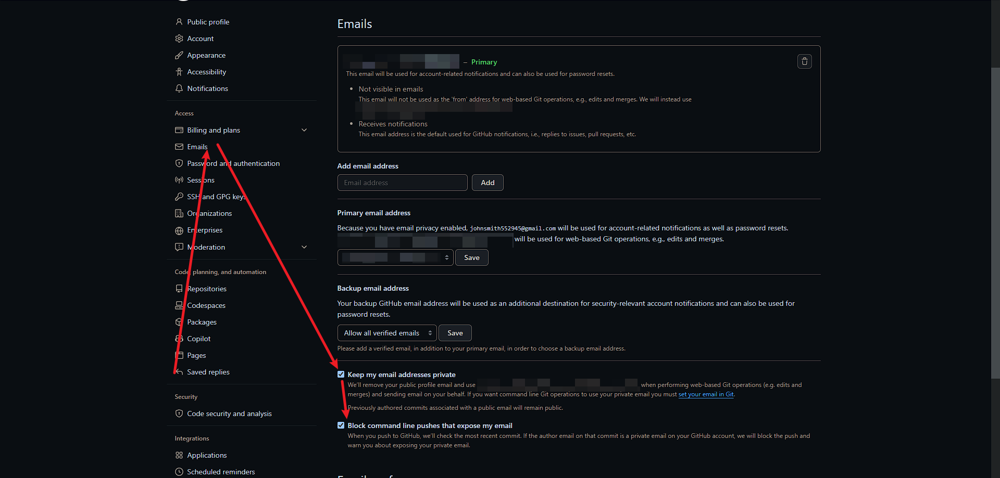

创建项目目录

```
C:\Users\sec\share\github\tool
```

在 Visual Studio Code 中打开项目文件夹

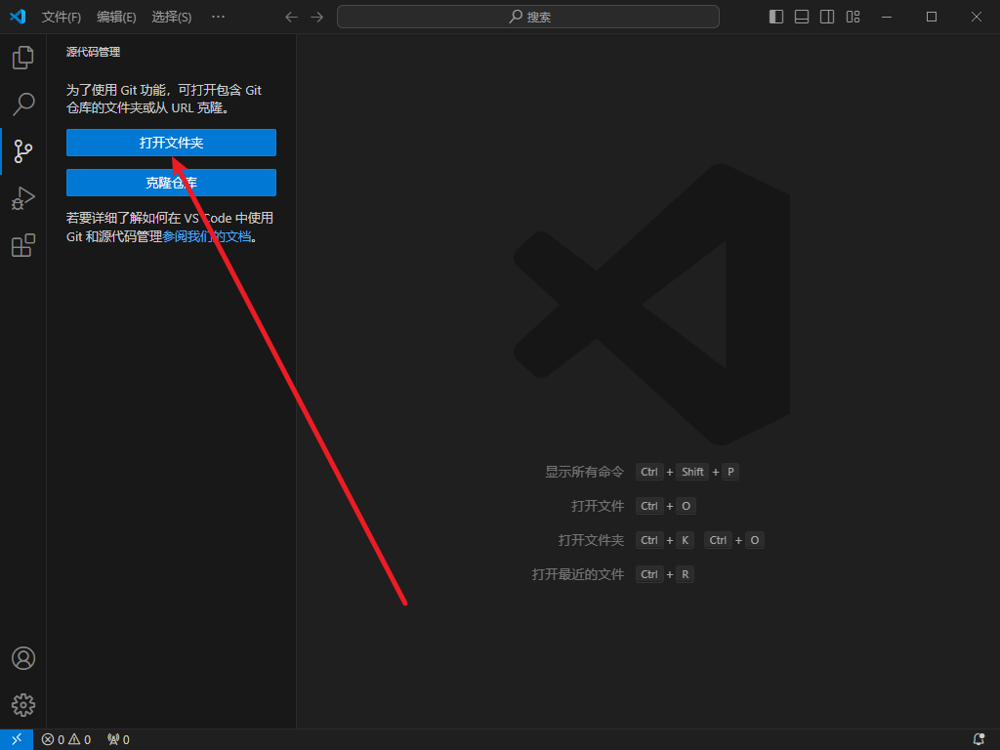

信任此作者

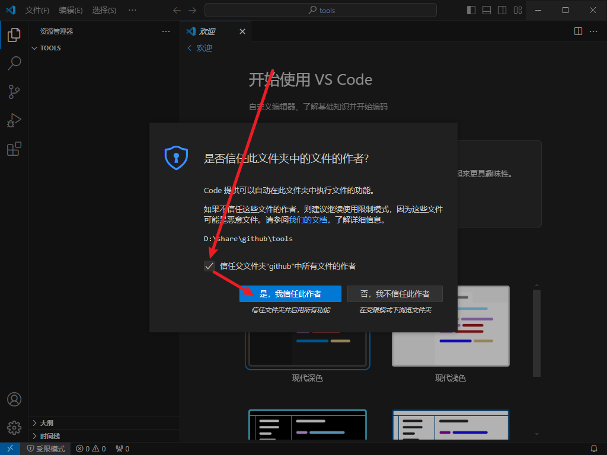

授权

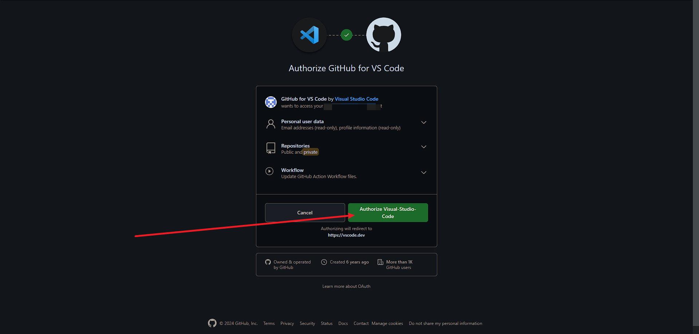

初始化仓库

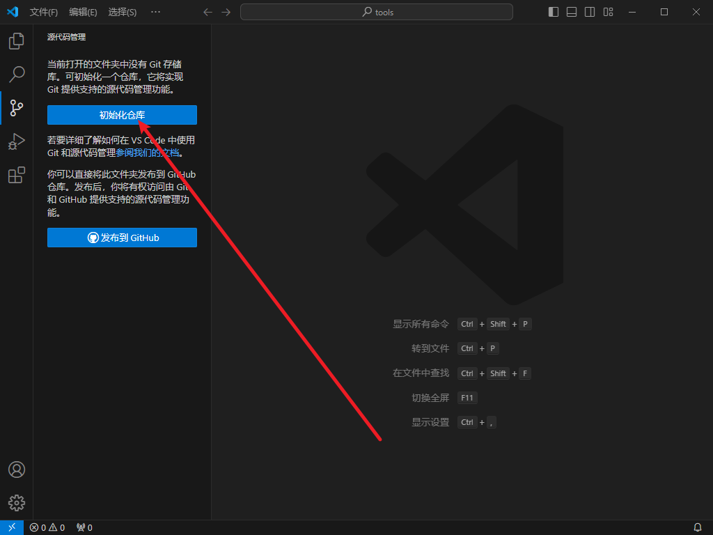

在项目中创建 README.md

```markdown
# "the quieter you become, the more you are able to hear"
```

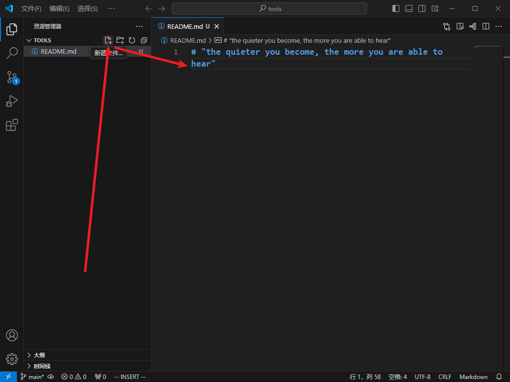

暂存更改

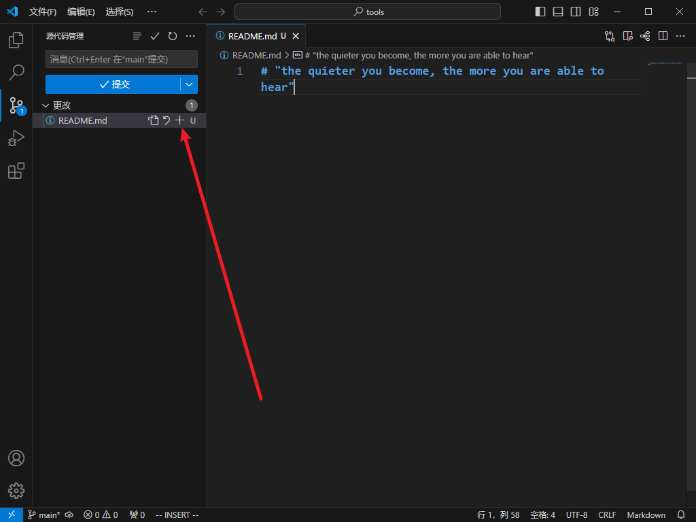

添加备注，提交到本地仓库

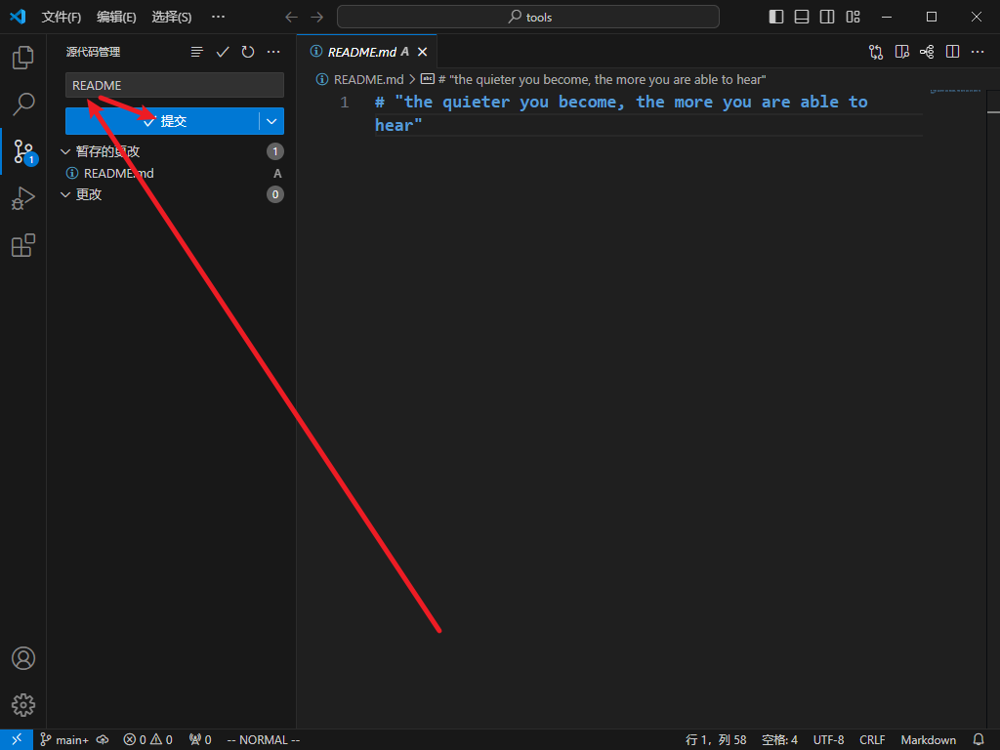

发布到远程仓库

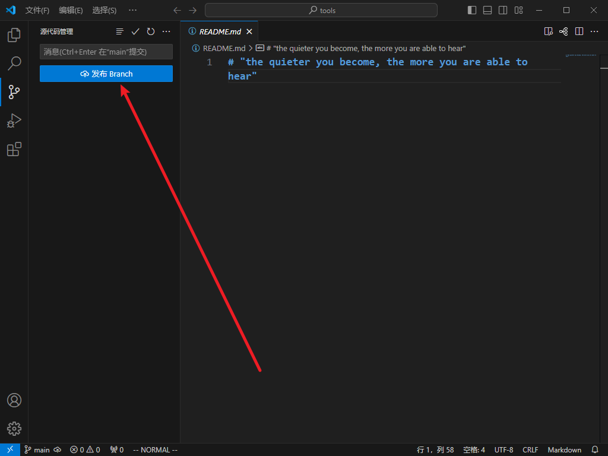

选择仓库

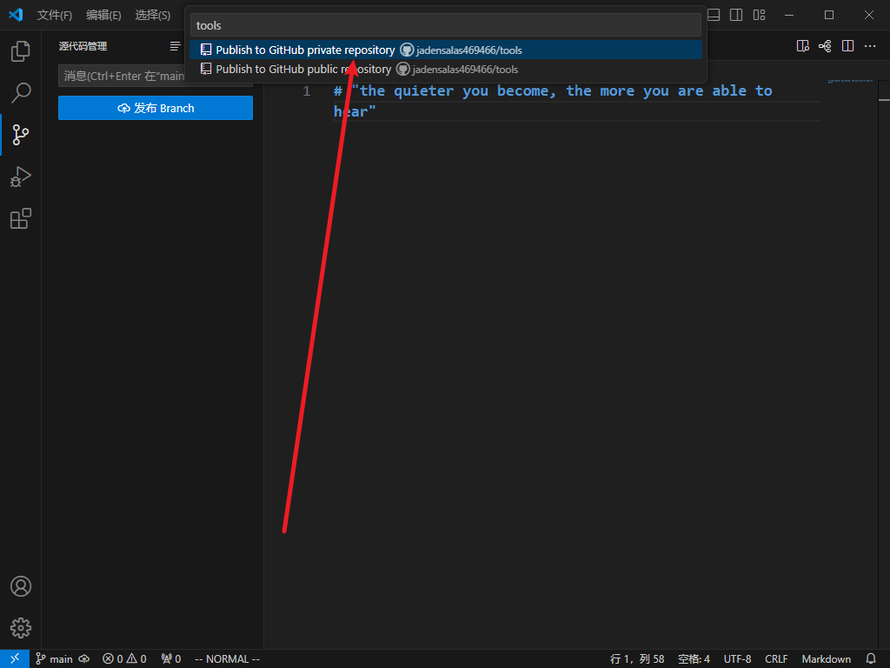

> 之后，在 tool 项目中的任何改动都可以同步到 Github 中
>
> 已创建的仓库可通过拉取到本地同步

# 帮助

```shell
sec@a MINGW64 ~
$ git -h
```

```
用法：git [-v | --version] [-h | --help] [-C <path>] [-c <name>=<value>]
           [--exec-path[=<path>]] [--html-path] [--man-path] [--info-path]
           [-p | --paginate | -P | --no-pager] [--no-replace-objects] [--bare]
           [--git-dir=<path>] [--work-tree=<path>] [--namespace=<name>]
           [--config-env=<name>=<envvar>] <command> [<args>]

这些是在各种情况下使用的常见 Git 命令：

开始一个工作区（也可参阅：git 帮助 教程）
   clone     将存储库克隆到新目录中
   init      创建一个空的 Git 存储库或重新初始化现有存储库

处理当前更改（也可参阅：git 帮助 日常）
   add       将文件内容添加到索引中
   mv        移动或重命名文件、目录或符号链接
   restore   恢复工作树文件
   rm        从工作树和索引中删除文件

检查历史记录和状态（也可参阅：git 帮助 修订）
   bisect    使用二分搜索找到引入错误的提交
   diff      显示提交之间的更改，提交和工作树之间的更改等
   grep      打印匹配模式的行
   log       显示提交日志
   show      显示各种类型的对象
   status    显示工作树状态

增长、标记和调整您的常见历史记录
   branch    列出、创建或删除分支
   commit    记录对存储库的更改
   merge     将两个或多个开发历史记录合并在一起
   rebase    在另一个基本尖端之上重新应用提交
   reset     将当前 HEAD 重置为指定状态
   switch    切换分支
   tag       创建、列出、删除或验证用 GPG 签名的标签对象

合作（也可参阅：git 帮助 工作流程）
   fetch     从另一个存储库下载对象和引用
   pull      从另一个存储库或本地分支获取并集成
   push      更新远程引用以及关联的对象

'git help -a' 和 'git help -g' 列出可用的子命令和一些概念指南。
请参阅 'git help <command>' 或 'git help <concept>' 了解特定子命令或概念。
请参阅 'git help git' 以获取系统概述。
```

---

参考链接

- [Git](https://github.com/git/git)
