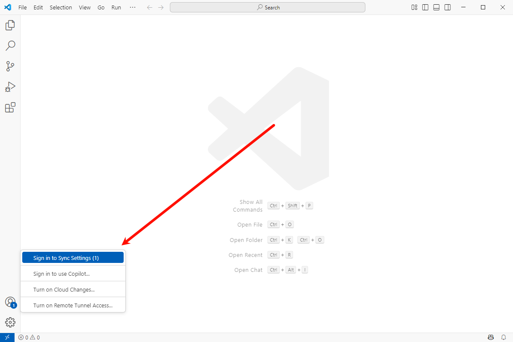
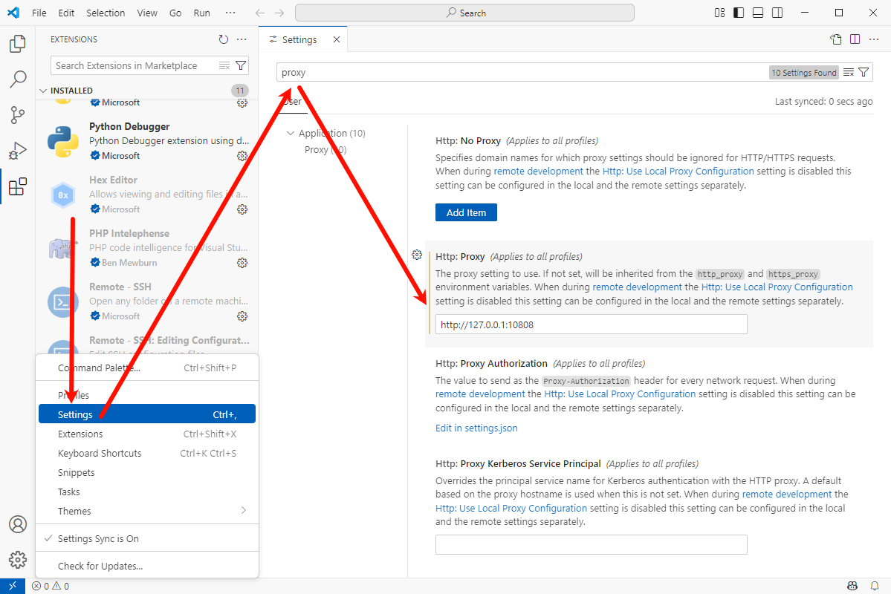

## 初始化

登录账号，同步设置



安装汉化


配置代理

```
socks5://127.0.0.1:10808
```



设置字体大小为 18


设置终端字体大小为 18


设置保存时格式化代码


工作区信任


## tool

|                                                                                tool                                                                                |
| :----------------------------------------------------------------------------------------------------------------------------------------------------------------: |
|                                             [Extensions for Visual Studio Code](https://marketplace.visualstudio.com/)                                             |
|                      [Bracket Pair Color DLW](https://marketplace.visualstudio.com/items?itemName=BracketPairColorDLW.bracket-pair-color-dlw)                      |
| [Chinese (Simplified) (简体中文) Language Pack for Visual Studio Code](https://marketplace.visualstudio.com/items?itemName=MS-CEINTL.vscode-language-pack-zh-hans) |
|                                    [Code Translate](https://marketplace.visualstudio.com/items?itemName=w88975.code-translate)                                     |
|                                       [Hex Editor](https://marketplace.visualstudio.com/items?itemName=ms-vscode.hexeditor)                                        |
|                                    [indent-rainbow](https://marketplace.visualstudio.com/items?itemName=oderwat.indent-rainbow)                                    |
|                                           [Python](https://marketplace.visualstudio.com/items?itemName=ms-python.python)                                           |
|                                     [Swagger Viewer](https://marketplace.visualstudio.com/items?itemName=Arjun.swagger-viewer)                                     |

---

参考链接

- [Visual Studio Code](https://code.visualstudio.com/)