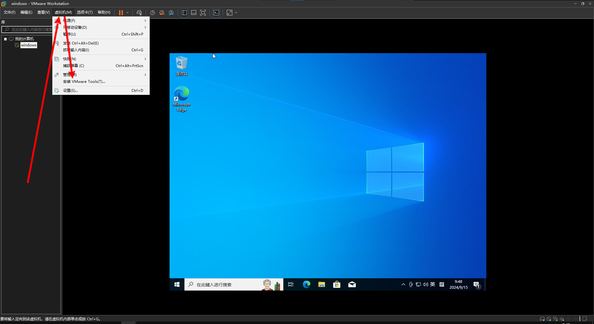
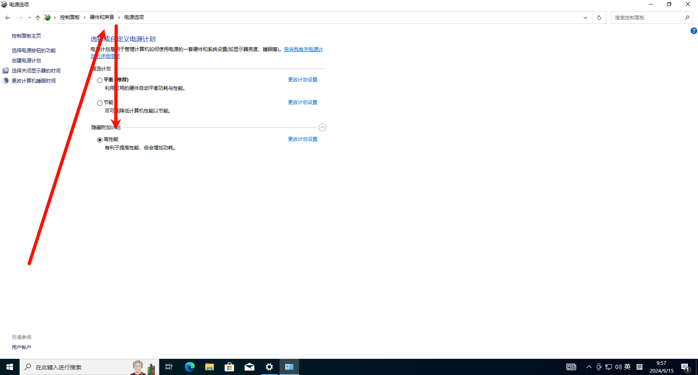
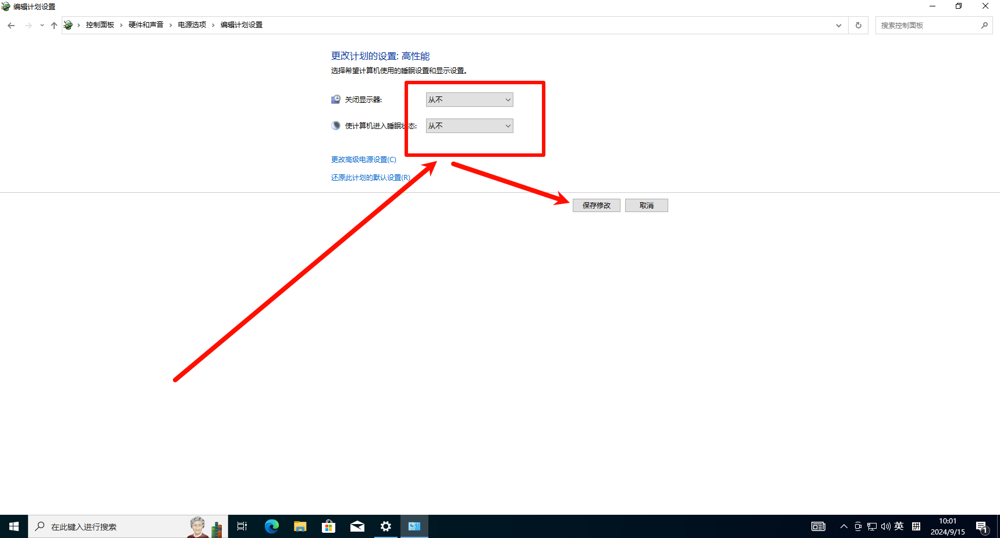
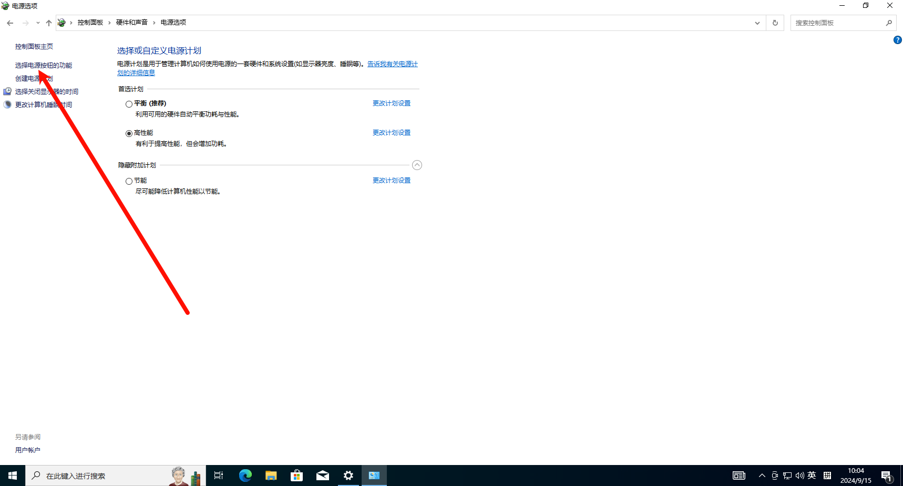
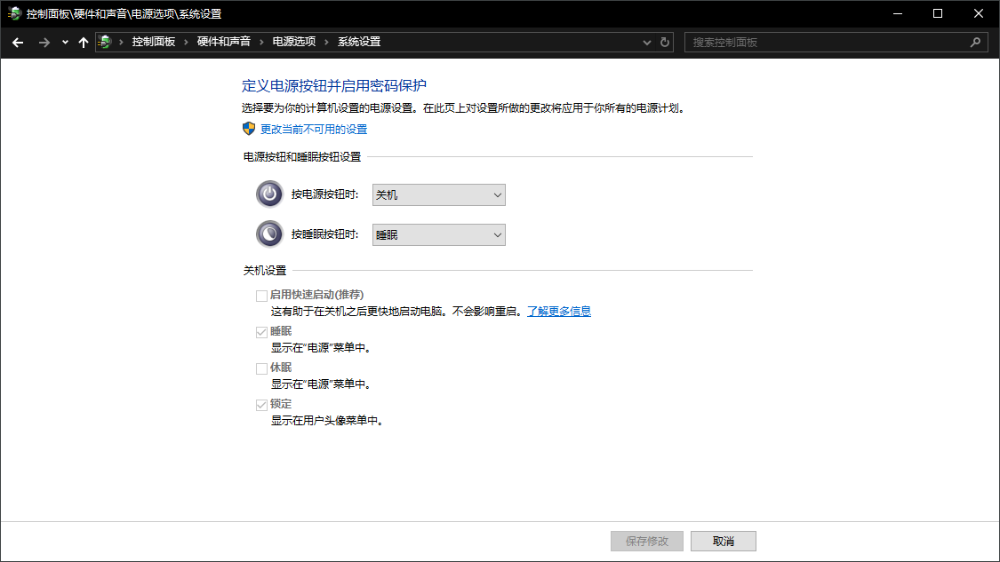
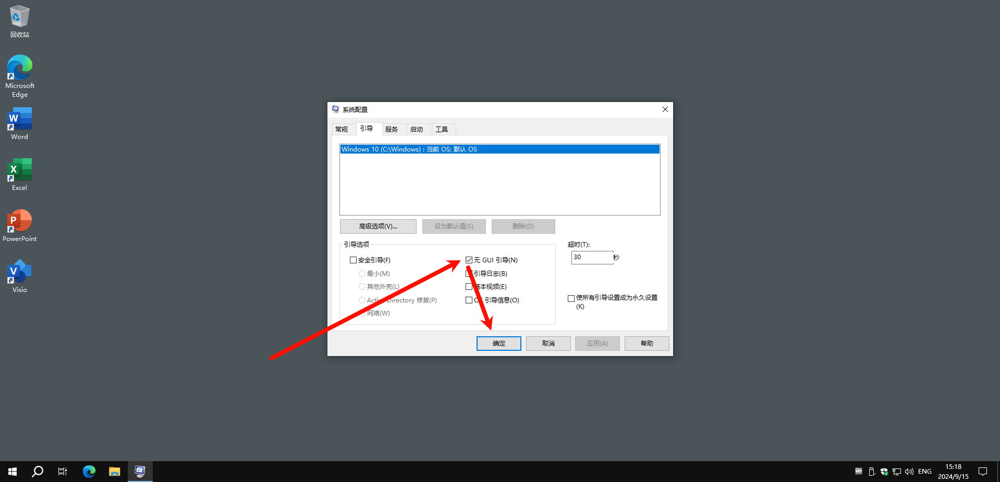
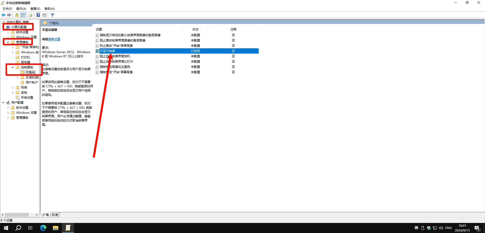
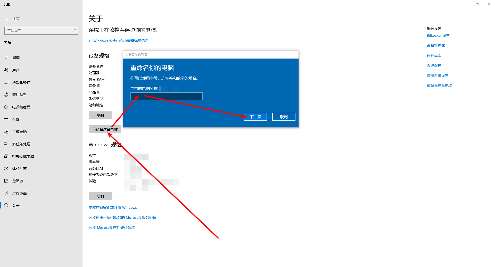
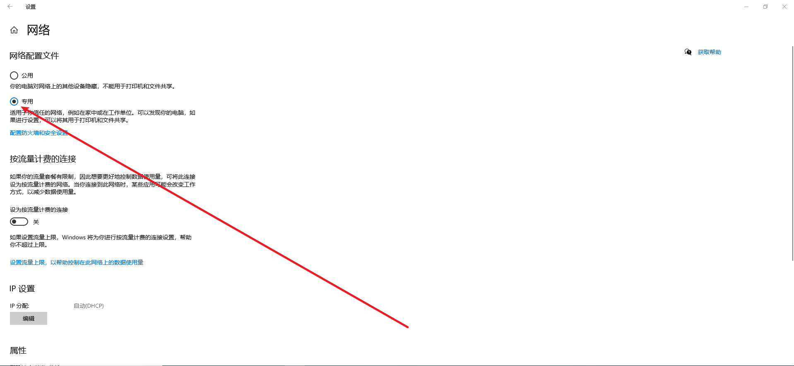

## 准备

Win10_22H2_Chinese_Simplified_x64v1.iso

```
https://www.microsoft.com/zh-cn/software-download/windows10ISO
```

**物理机**

WePE

```
https://www.wepe.com.cn
```

**虚拟机**

VMware

```
https://www.vmware.com/products/desktop-hypervisor/workstation-and-fusion
```

目录

```
C:\Users\sec\Documents\virtual machines\windows
```

## 配置

**物理机**

重启系统进入 Boot 菜单

```
需要关闭 Bitlocker
ASUS 是在启动引导界面按 Del 
TinkPad 是在启动引导界面按 F12 
```

选择 U 盘启动进入 WePE

进入 `Win10_22H2_Chinese_Simplified_x64v1.iso` ，运行 `setup.exe` ，进行安装

**虚拟机**

移动镜像文件到 `iso` 文件夹

```
C:\Users\sec\Documents\virtual machines\iso
```

VMware Workstation Pro

```
创建新的虚拟机
```

您希望使用什么类型的配置？

```
自定义
```

硬件兼容性

```
Workstation 17.5 or later
```

安装来源

```
稍后安装操作系统
```

客户机操作系统

```
Microsoft Windows
```

版本

```
Windows 10 x64
```

虚拟机名称

```
windows
```

位置

```
C:\Users\sec\Documents\virtual machines\windows
```

固件类型

```
UEFI
```

处理器数量

```
1
```

每个处理器的内核数量

```
2
```

此虚拟机的内存

```
8192 MB
```

网络连接

```
使用桥接网络
```

SCSI 控制器

```
LSI Logic SAS
```

虚拟磁盘类型

```
NVMe
```

磁盘

```
创建新虚拟磁盘
```

最大磁盘大小

```
128.0 GB
```

```
将虚拟磁盘存储为单个文件
```

磁盘文件

```
C:\Users\sec\Documents\virtual machines\windows\windows.vmdk
```

编辑虚拟机设置

虚拟化引擎

```
虚拟化 Intel VT-x/EPT 或 AMD-V/RVI
```

使用 ISO 映像文件

```
C:\Users\sec\Documents\virtual machines\iso\Win10_22H2_Chinese_Simplified_x64v1.iso
```

3D 图形

```
关闭加速 3D 图形
```

文件夹共享

```
总是启用
```

```
在 Windows 客户机中 映射为网络驱动器
```

添加共享文件夹

主机路径

```
C:\Users\sec\share\vmware
```

名称

```
vmware
```

其他属性

```
启用此共享
只读
```

拍摄快照并命名为 `配置` 

开启此虚拟机进行安装

## 安装

输入语言和其他首选项

```
要安装的语言：中文（简体，中国）
时间和货币格式：中文（简体，中国）
键盘和输入方法：微软拼音
```

现在安装

激活 Windows

```
我没有产品密钥 
```

选择要安装的操作系统

```
Windows 10 专业版
```

适用的声明和许可条款

```
我接受许可条款
```

你想执行哪种类型的安装

```
自定义：仅安装 Windows
```

您想将 Windows 安装在哪里

```
驱动器 0 未分配的空间
```

让我们先从区域设置开始。这样对吧？

```
美国
```

这种键盘布局是否合适？

```
微软拼音
```

是否要添加第二种键盘布局？

```
添加布局
```

你的第二个键盘布局想使用哪种语言？

```
英语(美国)
```

你要使用哪个键盘布局？

```
美式键盘
```

希望以何种方式进行设置？

```
针对个人使用进行设置
```

让我们添加你的账户

```
脱机账户
```

登录以尽情体验所有 Microsoft 应用和服务

```
有限的体验
```

谁将会使用这台电脑？

```
sec
```

创建容易记住的密码

```
123456
```

确认你的密码

```
123456
```

为此帐户创建安全问题

```
你第一个宠物的名字是什么？
123456
你出生城市的名称是什么？
123456
你的母校名称是什么？
123456
```

始终有权访问你最近的浏览数据

```
以后再说
```

为你的设备选择隐私设置

```
位置：否
诊断数据：否
量身定制的体验：否
查找我的设备：否
墨迹书写和键入：否
广告 ID：否
```

让我们自定义你的体验

```
跳过
```

让 Cortana 帮助你完成操作

```
以后再说
```

关机，快照命名为 `安装` 

## 初始化

**虚拟机**

安装 VMware Tools



**台式机**

进入控制面板修改电源选项


选择高性能模式



更改高性能模式计划设置



选择电源按钮的功能



定义电源按钮



**笔记本**

进入控制面板修改电源选项


进入控制面板选择平衡模式

更改平衡模式计划设置

选择电源按钮的功能

定义电源按钮

以管理员权限使用 powershell 运行以下命令禁用快速启动和休眠功能

```powershell
PS C:\Windows\system32> powercfg -h off
```

运行注册表，修改系统设置

```
关闭搜索框推荐.reg
```

```
Windows Registry Editor Version 5.00

[HKEY_CURRENT_USER\SOFTWARE\Policies\Microsoft\Windows\Explorer]
"ShowRunAsDifferentUserInStart"=dword:00000001
"DisableSearchBoxSuggestions"=dword:00000001


```

运行 msconfig ，在系统配置中关闭 GUI 引导



运行 gpedit.msc，在本地组策略编辑器启用不显示锁屏



修改设备名称



设置为专用网络



分配静态 IP 和 DNS

```
IP 地址 :「IP」
首选 DNS :「server_IP」
备用 DNS : 8.8.8.8
```

修改 hosts 文件

```shell
C:\Windows\System32\drivers\etc\hosts
```

在安全中心添加排除项

```
C:\Users\sec\AppData\Local\Programs\Typora\winmm.dll
C:\Users\sec\AppData\Local\Programs\Goby
C:\Users\sec\AppData\Local\Programs\Yakit
C:\Users\sec\AppData\Roaming\Typora\backups
C:\Users\sec\AppData\Roaming\Typora\draftsRecover
C:\Users\sec\Downloads
C:\Users\sec\share
D:\
```

使用 Geek 卸载不需要的应用

使用 Office Tool Plus 安装 Office 和 Visio

使用 MAS 激活 Windows、Office 和 Visio

```powershell
PS C:\Users\sec> irm https://get.activated.win | iex
```

| 激活类型   | 支持的产品           | 激活期限                 |
| :--------- | :------------------- | :----------------------- |
| HWID       | Windows 10-11        | 永久                     |
| Ohook      | Office               | 永久                     |
| KMS38      | Windows 10-11-Server | 到 2038 年               |
| Online KMS | Windows / Office     | 180 天。终身，有续费任务 |

更新驱动、系统、Edge 和应用

设置 Windows、Edge、Office、Visio 和 Microsoft Store

使用 Dism++ 修改系统设置

关机，快照命名为 `初始化` 

物理机创建文件，配置 SMB 文件共享

```
C:\Users\sec
├─Documents
│	├─KeePass
│	├─VeraCrypt
│	└─Virtual Machines
│		└─ISO
├─Pictures
|	└─截图
└─Share
	├─Code
	├─Github
	├─MuMu共享文件夹
	└─VMware
```

> ```
> 截图快捷方式路径：
> C:\Users\sec\AppData\Local\Packages\MicrosoftWindows.Client.CBS_cw5n1h2txyewy\TempState\ScreenClip
> ```

## 部署

|                            虚拟机                            |
| :----------------------------------------------------------: |
|               [7-Zip](https://www.7-zip.org/)                |
|             [Geek](https://geekuninstaller.com/)             |
| [OpenSSH](https://learn.microsoft.com/zh-cn/windows-server/administration/openssh/openssh_install_firstuse?tabs=powershell) |
|           [phpStudy](https://www.xp.cn/php-study)            |
|          [phpStudyPro](https://www.xp.cn/php-study)          |

关机，快照命名为 `部署` 

|                            笔记本                            |
| :----------------------------------------------------------: |
| [Lenovo System Update](https://www.lenovo.com/us/en/software/lenovo-system-update) |

|                            台式机                            |
| :----------------------------------------------------------: |
| [AMD Software꞉ Adrenalin Edition](https://www.amd.com/zh-cn/support/download/drivers.html) |
| [Twinkle Tray](https://github.com/xanderfrangos/twinkle-tray) |

|                            物理机                            |
| :----------------------------------------------------------: |
|               [7-Zip](https://www.7-zip.org/)                |
|            [AnyTXT Searcher](https://anytxt.net/)            |
| [Burp Suite Professional](https://portswigger.net/burp/pro)  |
| [ContextMenuManager](https://github.com/BluePointLilac/ContextMenuManager) |
| [Dism++](https://github.com/Chuyu-Team/Dism-Multi-language)  |
|              [Eraser](https://eraser.heidi.ie/)              |
|        [Everything](https://www.voidtools.com/zh-cn/)        |
|    [Firefox](https://www.mozilla.org/en-US/firefox/new/)     |
|          [FreeFileSync](https://freefilesync.org/)           |
|             [Geek](https://geekuninstaller.com/)             |
|                 [Git](https://git-scm.com/)                  |
|                 [Goby](https://gobysec.net/)                 |
|       [Google Chrome](https://www.google.com/chrome/)        |
|  [HashCalculator](https://github.com/hrpzcf/HashCalculator)  |
|                  [He3](https://he3.app/zh/)                  |
|      [ImageGlass](https://github.com/d2phap/ImageGlass)      |
| [Internet Download Manager](https://www.internetdownloadmanager.com/) |
|     [Java](https://www.java.com/en/download/manual.jsp)      |
|   [KeePassXC](https://github.com/keepassxreboot/keepassxc)   |
| [Koodo Reader](https://github.com/koodo-reader/koodo-reader) |
| [科来网络分析系统 技术交流版](https://www.colasoft.com.cn/products/capsa.php) |
|     [LocalSend](https://github.com/localsend/localsend)      |
|            [LockHunter](https://lockhunter.com/)             |
| [mitan](https://github.com/kkbo8005/mitan?tab=readme-ov-file) |
|             [MuMu模拟器](https://mumu.163.com/)              |
|                  [Nmap](https://nmap.org/)                   |
| [Notepad++](https://github.com/notepad-plus-plus/notepad-plus-plus) |
|            [OBS Studio](https://obsproject.com/)             |
|        [Pinta](https://github.com/PintaProject/Pinta)        |
|               [PixPin](https://pixpinapp.com/)               |
|             [Postman](https://www.postman.com/)              |
|              [Potplayer](https://potplayer.tv/)              |
|           [Proxifier](https://www.proxifier.com/)            |
|              [Python](https://www.python.org/)               |
| [qBittorrent-Enhanced-Edition](https://github.com/c0re100/qBittorrent-Enhanced-Edition) |
|            [RaiDrive](https://www.raidrive.com/)             |
|          [RealTimeSync](https://freefilesync.org/)           |
| [script](https://github.com/jadensalas469466/tool/tree/main/script) |
|      [Stretchly](https://github.com/hovancik/stretchly)      |
|  [Subtitle Mask](https://github.com/chocovon/subtitle-mask)  |
|             [Syncthing](https://syncthing.net/)              |
|              [Telegram](https://telegram.org/)               |
|       [TTime](https://github.com/InkTimeRecord/TTime)        |
|     [TurboTop](https://www.savardsoftware.com/turbotop/)     |
|                 [Typora](https://typora.io/)                 |
|          [v2rayN](https://github.com/2dust/v2rayN)           |
|      [VeraCrypt](https://www.veracrypt.fr/en/Home.html)      |
|                 [Vim](https://www.vim.org/)                  |
|     [Visual Studio Code](https://code.visualstudio.com/)     |
| [VMware](https://www.vmware.com/products/desktop-hypervisor/workstation-and-fusion) |
| [Windows Terminal](https://github.com/microsoft/terminal?tab=readme-ov-file) |
|                [微信](https://weixin.qq.com/)                |
|                 [Xmind](https://xmind.app/)                  |
|          [Yakit](https://github.com/yaklang/yakit)           |

---

参考链接

- 

