将 GitBook 关联到 GitHub，自动同步 GitHub 中的文档

# 初始化

选择 GitHub Sync 插件

启用这个插件

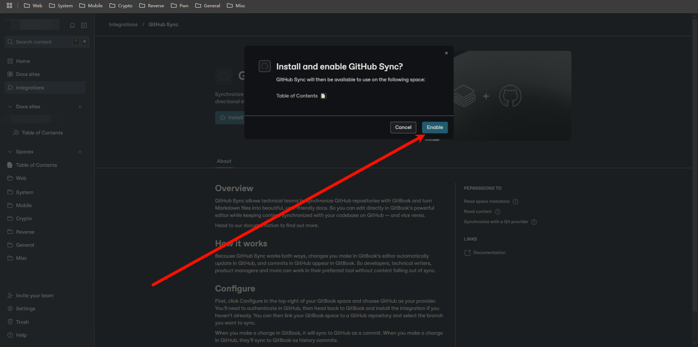

进入同步配置

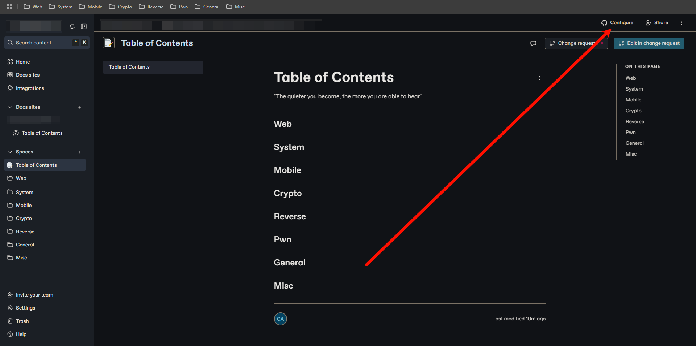

连接到 GitHub

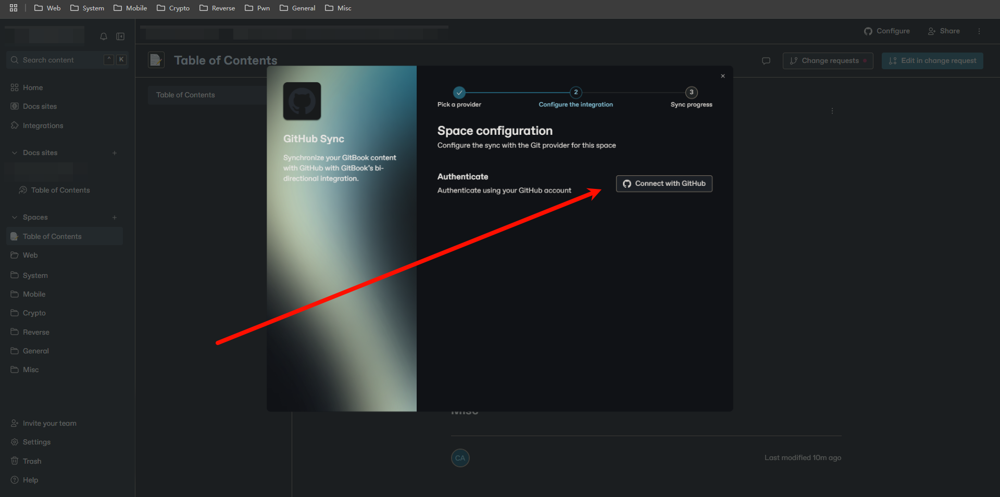

授权 GitBook 连接到 GitHub

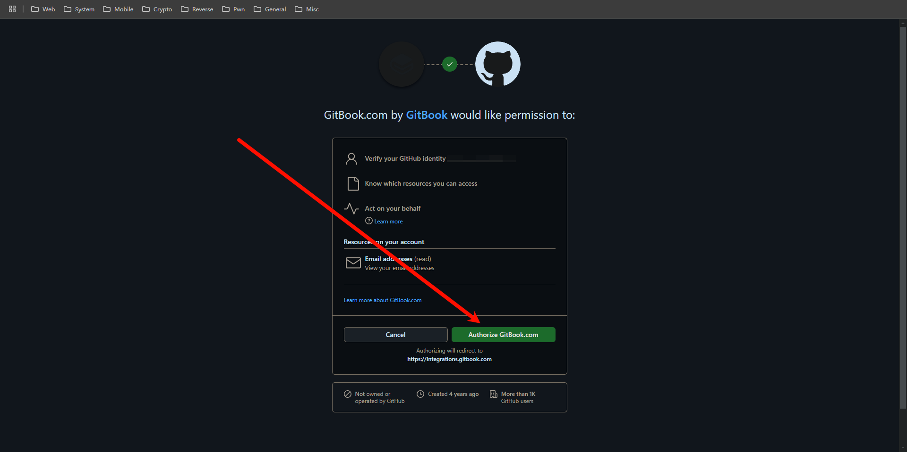

安装 GitBook 插件

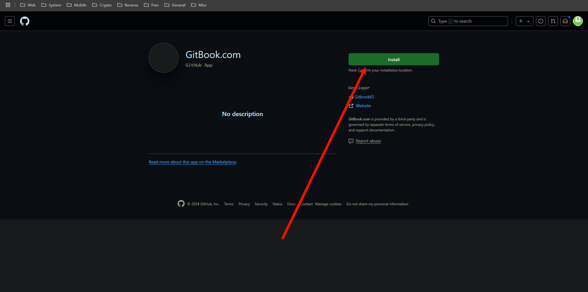

确认允许访问账户下的所有仓库

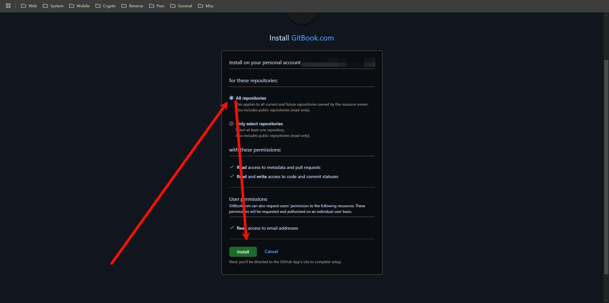

选择已连接的 GitHub 账户

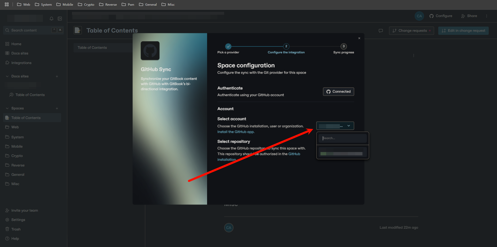

选择一个仓库用于同步

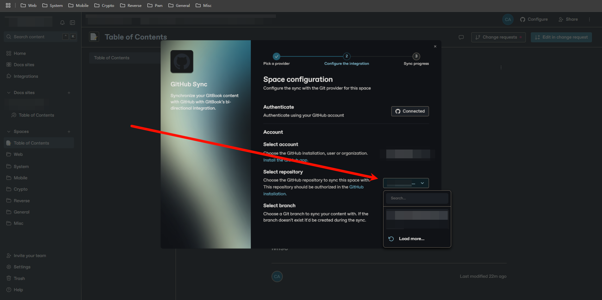

选择需要同步的分支

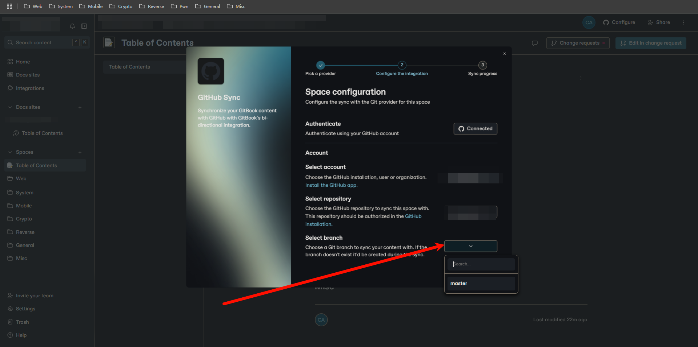

选择要同步的目录

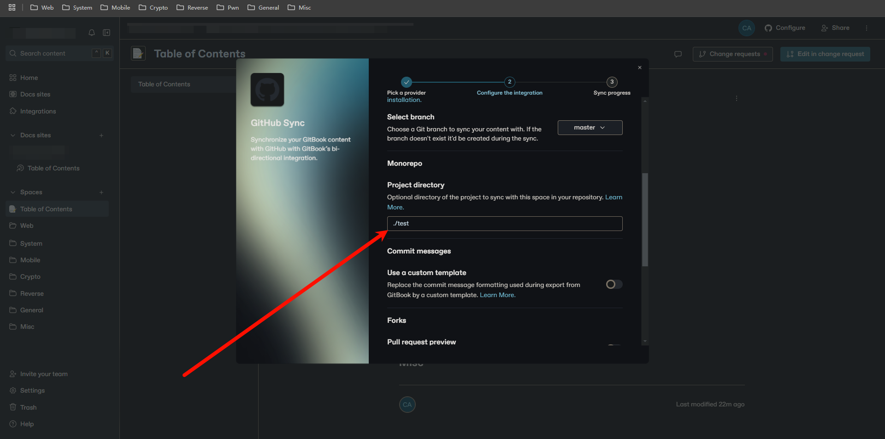

选择从 GitHub 同步到 GitBook

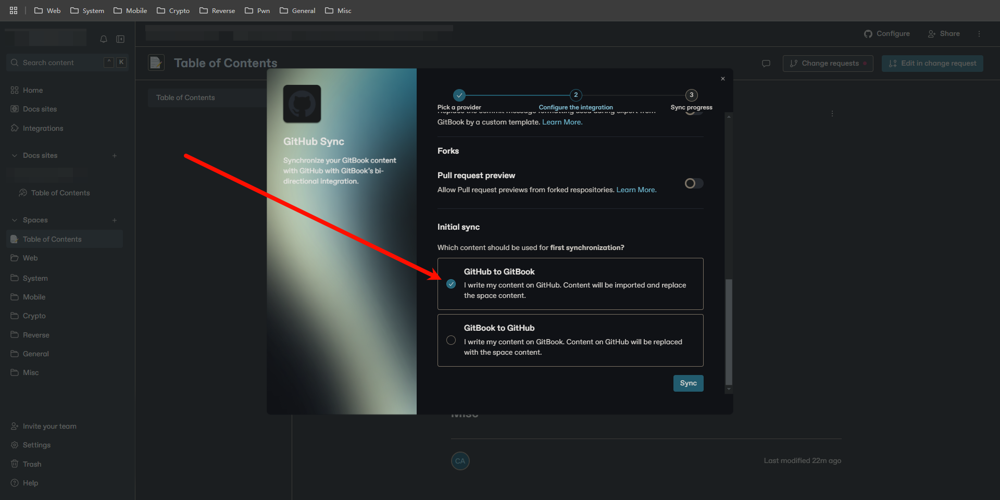

开始同步

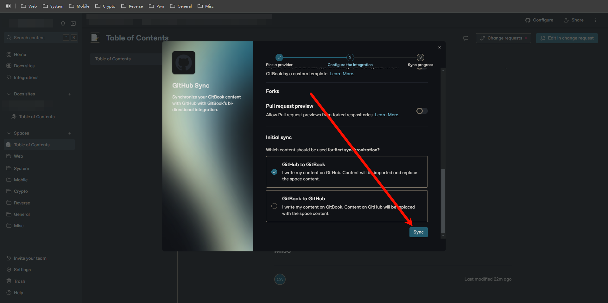

此时 GitHub 仓库中 `test` 目录下的所有文档将被同步到 GitBook 的 `Space` 中

若唯一的一级标题在首行，GitBook 不会将文件名显示为主标题
