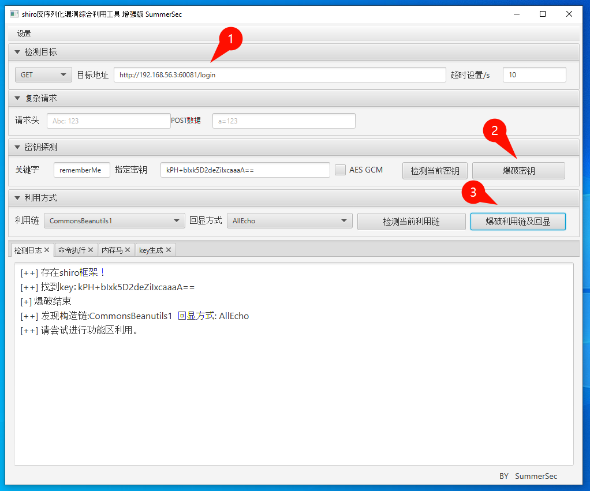
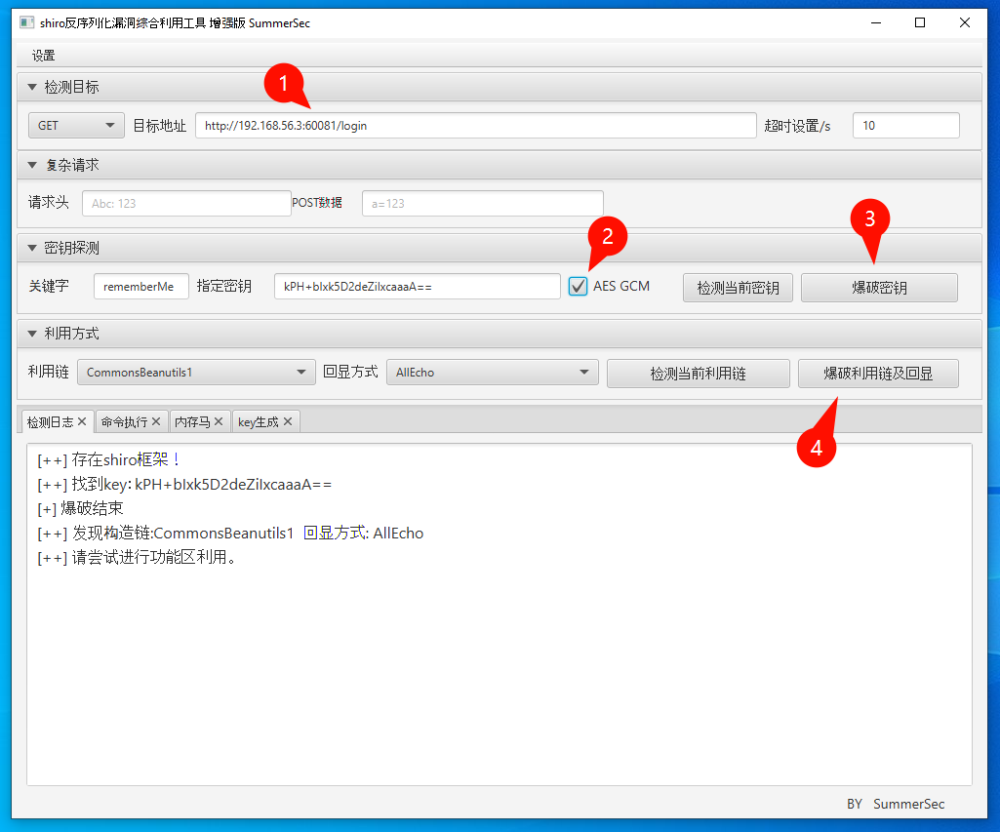

shiro反序列化漏洞综合利用

## 1. Step

[JDK 8u202](https://www.oracle.com/java/technologies/javase/javase8-archive-downloads.html)

## 2. Init

```
C:\Users\nemo\Apps\shiro_attack-4.7.1-SNAPSHOT\ShiroAttack2_Pro.vbs
```

```
Dim WshShell, javaPath, jarPath, command

' 指定 JDK 路径
javaPath = "C:\Program Files (x86)\Java\jre1.8.0_202\bin\javaw.exe"

' 指定 JAR 路径
jarPath = "C:\Users\nemo\Apps\shiro_attack-4.7.1-SNAPSHOT\shiro_attack-4.7.1-SNAPSHOT.jar"

' 构建启动命令
command = Chr(34) & javaPath & Chr(34) & " -jar " & Chr(34) & jarPath & Chr(34)

' 执行命令 (隐藏窗口)
Set WshShell = CreateObject("WScript.Shell")
WshShell.Run command, 1

```

## 3. Usage

- [CVE-2016-4437](https://hackerone.com/hacktivity/cve_discovery?id=CVE-2016-4437) (Shiro < 1.2.5, ==未修复: 建议自行配置随机密钥==)

  ```
  vulfocus/shiro-cve_2016_4437:latest
  ```

- [CVE-2019-12422](https://hackerone.com/hacktivity/cve_discovery?id=CVE-2019-12422) (Shiro < 1.4.2, ==已修复: AES-CBC -> AES-GCM==)

  ```
  vulfocus/shiro-721:latest
  ```

AES-CBC (Shiro < 1.4.2)



AES-GCM (Shiro ≥ 1.4.2)



---

References

- [ShiroAttack2](https://github.com/SummerSec/ShiroAttack2)
- [ShiroAttack2_Pro](https://github.com/Chave0v0/ShiroAttack2_Pro)

